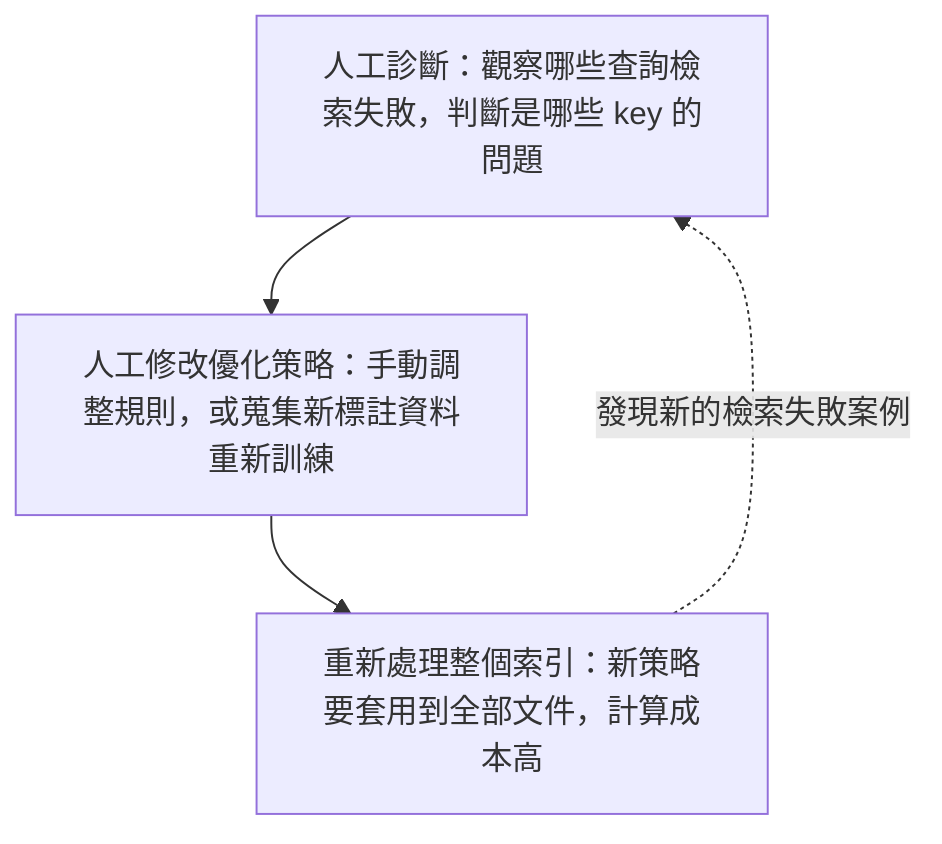
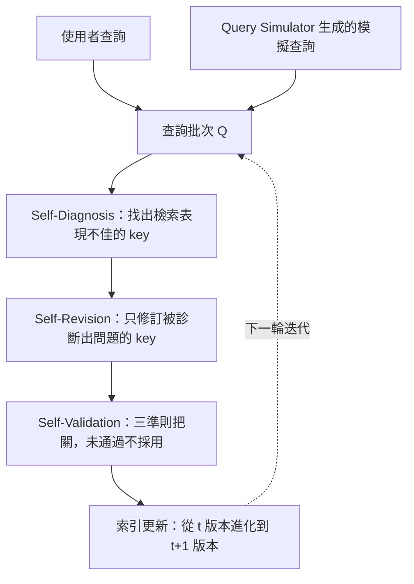
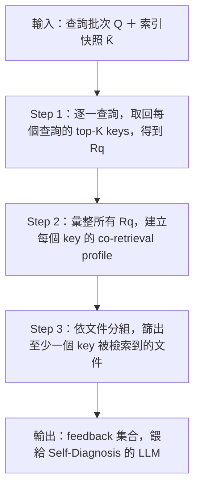
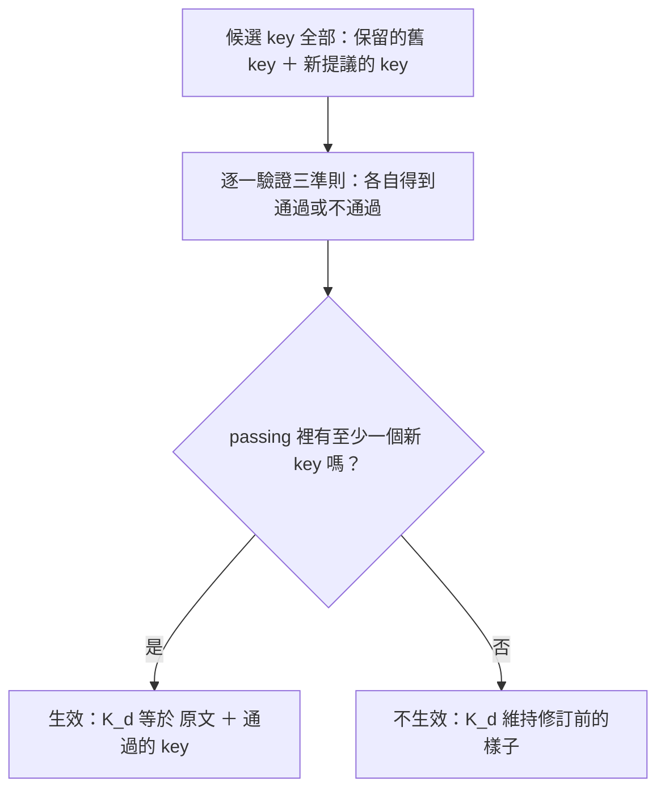
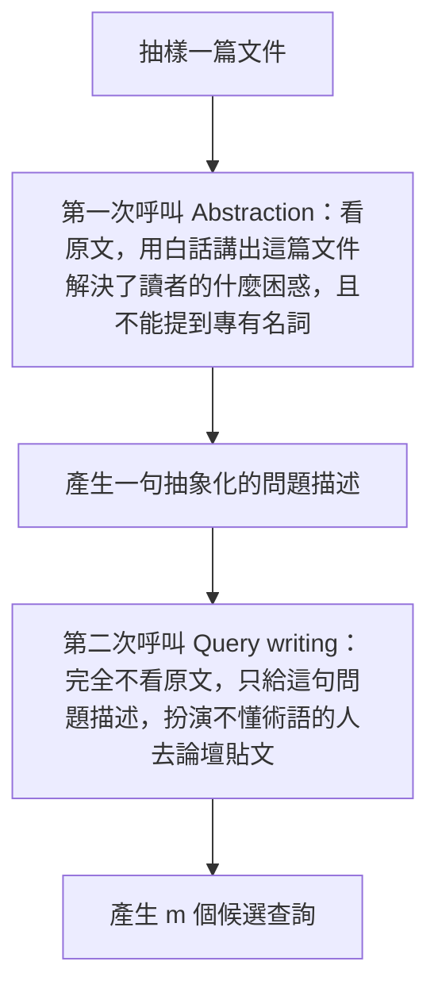
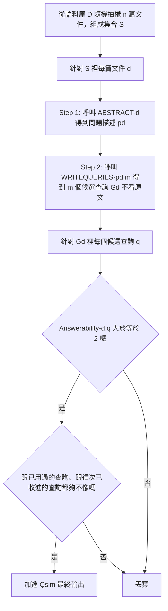

# SELF-INDEX 論文筆記：自我進化的檢索索引

Sep 27, 2026 · @YHHW

## 索引：本筆記的核心問答

這篇筆記除了照論文結構講解方法與實驗，還特別把討論過程中釐清的關鍵疑問獨立標記出來——這些疑問代表的是「讀論文時最容易誤解、但論文原文沒有講清楚」的地方，價值通常比論文本身的敘述更高。可以直接跳到以下任一節：

- 「Self-Diagnosis 是不是對整個語料庫的所有文件都做一次診斷？」（見 Self-Diagnosis 一節）
- 「一次 Self-Diagnosis 的具體輸入輸出長什麼樣？」（見 Self-Diagnosis 一節）
- 「原文 key 會不會被修改？它會不會消失？」（見 Self-Diagnosis 一節）
- 「一篇文件對應多筆查詢時，回饋資料是怎麼組織的？」（見 Self-Diagnosis 一節）
- 「Self-Revision 只會新增 key 嗎？會不會修改或移除舊的 key？」（見 Self-Revision 一節）
- 「keep 和 revised 兩個欄位，實際上是怎麼決定最終 key 集合的？」（見 Self-Revision 一節）
- 「被保留（keep）的舊 key 也需要重新通過 Faithfulness 驗證嗎？」（見 Self-Validation 一節）
- 「一次 Self-Validation，是逐一 key 各自生效，還是整包提案一起生效？」（見 Self-Validation 一節，含一個論文沒有明講、但邏輯上必然成立的推論）
- 「所有的 LLM 裁判角色，是不是都共用同一顆模型？這代表什麼風險？」（見 Self-Validation 一節）
- 「Dissimilarity 過濾，為什麼用 Jaccard similarity 而不是 embedding cosine similarity？」（見 Query Simulator 一節）
- 「跟 DCI 這個對照組比較的可信度如何？」（見實驗結果一節）

## 30 秒版本與整體評價

**論文資訊**：Self-Evolving Search Index（arXiv 2609.19656v1），Yonsei University + Samsung Research，2026 年 9 月。

**一句話總結**：這篇論文提出 SELF-INDEX，讓檢索用的「索引」自己進化——不再靠人工診斷檢索失敗、人工調整優化策略、再重新處理整個索引，而是讓一個 LLM「Optimizer」自動診斷索引哪裡有缺陷、只修有問題的那一小部分、並且驗證修訂是否真的有效才套用；同時搭配一個「Query Simulator」主動生成「還沒被問過、但可能會被問」的查詢，讓索引不只是被動反應已知問題。

**整體評價：工程價值高，研究價值中等偏低（但不是零）。**

工程價值高的原因：

1. 選擇性修訂 + 驗證閘門的組合是最實用的設計——消融實驗顯示，拿掉整個驗證機制，效果甚至會掉到比原始索引還差，證明「讓 LLM 自己修索引」這件事本身很危險，把關不是錦上添花，是必要條件。
2. 下游驗證做得扎實：不只看檢索指標，還接到真實 agent 任務（BrowseComp-Plus，看答案準確率跟成本）、接到 agent memory 系統（LongMemEval-V2），證明效益能從「檢索變好」一路延伸到「真實任務變好」。
3. 論文主動做了「排除混淆變因」的乾淨對照（把對照組 SPIKE 的計分方式換成跟自己一樣，證明贏的是 key 品質，不是計分技巧取巧）。
4. 有量化成本效率：多數迭代點上，累積成本比對照組全語料重建索引還低，效果卻更好。

研究價值中等偏低的原因：

1. 拆開來看，三個核心元件都不是新東西：co-retrieval profile 的診斷精神源自 1971 年的 pseudo-relevance feedback；LLM 自我驗證的迴圈在自我改進型 agent 文獻裡很常見；合成查詢生成 Doc2Query（2019）就在做了。這篇論文的貢獻主要是「把這幾塊組裝起來，套用在索引優化這個具體問題上」，不是概念上的突破。
2. 驗證機制有一個結構性弱點：负責判斷「這個 key 忠不忠實於原文」的裁判，跟負責生成這個 key 的 Optimizer，是**同一顆 backbone 模型**（Qwen3.6-35B-A3B）。論文沒有报告過人工抽查裁判判斷準確度的結果，也沒有做過「換一顆獨立模型當裁判」的對照實驗，所以「自己人審自己人」這件事的可信度有多高，是個沒有被回答的問題。
3. 附錄裡的案例研究全部是精選的成功案例（作者自己在附錄開頭承認 selected success cases），沒有失敗案例分析，讀者看不到這套機制什麼時候會失敗、怎麼失敗，只能從消融實驗的數字反推。

這份筆記接下來會照論文的方法論架構走一遍，把三個核心機制（Self-Diagnosis、Self-Revision、Self-Validation）跟 Query Simulator 的細節講清楚，再快速帶過實驗數字，最後用比較多的篇幅整理消融實驗（這是整篇論文最有資訊量、也最值得記住的部分）跟最終「值得帶走的東西」。

## 背景：這篇論文想解決什麼問題

### Index key 是什麼

在講問題之前要先建立一個概念：**索引（index）不是文件本身，是文件的「代表」**。

語料庫裡每一篇文件 d，會被賦予一組 **index key**，記作 K(d)——這些 key 才是檢索器實際拿去跟查詢比對的文字。檢索時，系統不是拿查詢直接跟原始文件比對，而是拿查詢去跟每個 key 比對，取分數最高的那個 key 當作這篇文件的分數：

```
s(q, d) = max_{k ∈ K(d)} rel(q, k)
```

意思是：文件 d 對查詢 q 的分數，等於「d 底下所有 key 裡，跟 q 最相關的那一個」的分數。

**具體例子**：假設有一篇文件是講「手部肌腱解剖構造」的教科書段落。最原始的做法（K0(d) = {d}，也就是「第 0 版索引」）是把整段原文直接當作唯一的 key。但如果使用者的查詢是口語化的「為什麼無名指不能單獨動？」，這句查詢跟教科書式的原文用詞差異很大，向量相似度可能不高，這篇文件就可能排不進前面的結果。

這就是「index key 設計」存在的原因：與其只用原文當 key，不如額外生成一些用不同角度、不同用詞描述同一篇文件內容的 key，讓文件有更多「被找到的入口」。這整套「幫文件生成／修改 key」的操作，叫 **index optimization（索引優化）**。

### 挑戰一：沒有一種優化策略能通吃所有場景

index optimization 的效果高度依賴「檢索環境」，包括語料庫的類型（自然語言／程式碼／數學／表格）跟使用的檢索器（稀疏檢索如 BM25，或密集檢索如向量嵌入）。論文引用既有文獻指出，在一種環境下有效的優化策略，換到另一種環境可能效果打折甚至變差——這一點在後面的實驗數字裡看得很清楚：Doc2Query 這個方法在表格檢索上大幅提升效果，但套用到程式碼語料反而讓效果變差。

換句話說：沒辦法設計一套「萬用」的 key 生成規則，寫死了套用到任何語料上都好用。

### 挑戰二：進化索引這件事，目前完全靠人工

這是論文真正想打的痛點。現有方法要「進化」一個索引，需要人做三件苦差事，而且這個迴圈不是做一次就結束——新的檢索失敗案例會不斷冒出來，這三步要一直重複做：



論文特別點出第三步的浪費：就算只發現「某一小群」文件的 key 設計得不好，現有方法通常還是要把修改後的策略重新套用到**整個語料庫**，而不是只修那一小群有問題的文件。

### 挑戰三：Optimizer 就算做出來了，也只能被動反應

就算解決了上面兩個問題，讓一個 Optimizer 能自動診斷、修訂索引，它也只能對「已經收到的查詢」做反應——如果某種提問方式從來沒出現在它看過的查詢裡，即使索引在這個面向上有缺陷，Optimizer 也完全不會發現。這是一種被動反應式（reactive）的模式，就像一個客服部門只會改善「已經有人抱怨過」的問題，不會主動想「還有哪些客戶可能遇到、但還沒抱怨出來的問題」。

### 這篇論文的解法，一句話總結

把「人工診斷 → 人工修策略 → 全量重新處理」這個迴圈，換成一個自動化、選擇性的迴圈：讓 LLM 自己診斷問題、自己只修有問題的那部分 key、自己驗證修改是否真的有效，不需要人工介入，也不用重新處理整個索引——這是 Optimizer 負責的部分。同時搭配 Query Simulator 主動生成還沒被問過的查詢，解決「被動反應」這個限制。

## SELF-INDEX 整體架構

對應論文 **Figure 1**（原文 caption：*"Overview of the SELF-INDEX framework. Given observed queries or queries generated by the Query Simulator, the Optimizer autonomously (1) diagnoses index shortfalls from retrieval outcomes, (2) selectively revises the affected key sets, and (3) validates revisions, updating the index only with accepted changes. As this exploration and optimization loop repeats, the index evolves."*）——建議直接對照原圖看，圖裡多畫出了每個階段內部的具體資料結構（co-retrieval profile 矩陣、K(d)→K'(d) 對照、三個驗證準則的長條圖），下面的圖只呈現整體資料流。



這張圖呈現的是一輪迭代的完整資料流：

1. **兩個查詢來源匯流**：真實使用者查詢跟 Query Simulator 生成的模擬查詢，兩者被合併成同一批查詢集合 Q，一起餵給 Optimizer 處理——Optimizer 不需要區分這批查詢的來源，處理方式完全一樣。
2. **Optimizer 內部三階段依序執行**：Self-Diagnosis 先跑過這批查詢的檢索結果，找出「哪些文件的 key 表現不好」；只有被診斷出問題的文件，才會進入 Self-Revision 被重新設計 key（沒問題的文件完全不受影響，這是「選擇性」的精髓）；Self-Revision 提出的新 key，還要通過 Self-Validation 的三重驗證，沒通過就維持原狀。
3. **索引更新**：只有通過驗證的修訂才會真的寫入索引，讓索引從 t 版本進化到 t+1 版本。
4. **迴圈重複**：t+1 版本的索引會成為下一輪迭代的起點，用新的一批查詢再跑一次同樣的三階段流程——這就是「self-evolving」這個名稱的由來：索引不是一次性優化完就結束，而是持續、漸進地演化。

接下來三節分別展開 Self-Diagnosis、Self-Revision、Self-Validation 的具體機制，這是整篇論文份量最重、也最值得記住的部分。

## Self-Diagnosis：如何在沒有人工標註的情況下發現索引的問題

Self-Diagnosis 要做的事，是「看著這批查詢的檢索結果，判斷索引裡哪些 key 有問題」。整個過程完全不用到任何人工標註的相關性標籤——這是 SELF-INDEX「不需要人工介入」這個核心賣點的具體實現方式。

### ❓ 追問：是不是對整個語料庫的所有文件都做一次診斷？

**不是。** 這是一個很容易誤解的地方。Self-Diagnosis 只針對「這一批查詢有檢索到其 key 的文件」做診斷，不是對資料庫裡每一篇文件都跑一次。

對應 Algorithm 1 的原文邏輯：

```
foreach document d with a retrieval feedback record do
    diagnosis ← DIAGNOSE(feedback[d])
```

注意 `with a retrieval feedback record` 這個限定詞——只有出現在 feedback 集合裡的文件才會進入這個迴圈，而 feedback 集合只收錄「這一批查詢的 top-K 檢索結果裡，至少出現過一次其 key」的文件。

**具體數字感受**：假設資料庫有 100 篇文件，這一輪批次有 128 個查詢（論文實驗設定的 batch size），每個查詢檢索 top-30 個 key（K=30）。這些檢索結果實際上會集中在資料庫裡的一小部分文件上，而不是均勻打到全部 100 篇。假設最後只有 45 篇文件的某個 key 曾經出現在這 128 次檢索結果裡，那麼這一輪 Self-Diagnosis 就只會呼叫 45 次診斷（45 次 LLM 呼叫），而不是 100 次。

這正好呼應「選擇性」這個設計精神——不只是「選擇性修訂」，連「選擇性診斷」都是同樣邏輯：跟這一批查詢完全無關的文件，連被 LLM 看一眼、判斷要不要改的機會都沒有，成本自然被壓低。這也解釋了論文 Table 20 裡看到的現象：累積成本不是隨著「文件總數」線性增長，而是隨著「查詢批次數（迭代輪數）」增長。

### Algorithm 2（Collecting retrieval feedback）：完整流程



對照論文的變數符號逐步拆解：

**輸入**：Q（這一輪查詢批次，可能混合真實查詢跟模擬查詢）、D（整個語料庫）、K̄（這一輪迭代開始前**固定住**的索引快照——固定住是為了確保這一輪的診斷是根據同一個索引版本做的，不會因為中途索引被修改而讓比較失真）、K（檢索深度，實驗設定 K=30）。

**Step 1**：對批次裡每一個查詢 q，從固定的索引快照 K̄ 撈出排名前 K 個 key，結果記作 Rq。跑完會得到 |Q| 組 Rq。

**Step 2**：把**所有**查詢的 Rq 集合起來（不是逐一處理，是看整批結果），統計出每個被檢索到的 key 的 co-retrieval profile，記作 {Ck}。

**Step 3**：前兩步是以「查詢」跟「key」為單位處理，但最終要以「文件」為單位輸出。檢查每一篇文件 d，只要 d 底下至少有一個 key 曾出現在任何一個 Rq 裡，就幫 d 建一筆記錄，內容包含：這篇文件的原文、d 目前的完整 key 集合（不只是被檢索到的那個 key，是全部）、這些 key 對應的 co-retrieval profile、以及「哪些查詢檢索到了 d 的 key、分數多少」（這部分只收錄真的檢索到 d 的那些查詢）。

**輸出**：以文件為 key 的字典 feedback，送進 Self-Diagnosis 的 LLM 呼叫，判斷「該不該修」。

### co-retrieval profile：核心機制

**先講直覺**：想像幫每本書寫「索引卡」，讀者拿問題來查索引卡找書。如果某張索引卡寫得太籠統（比如「這是一本關於機器學習的書」），幾乎任何跟機器學習沾邊的問題，都會把這張卡片跟其他書的卡片一起翻出來。反過來，如果一張索引卡寫得夠精準，它應該只在真正相關的少數查詢下，才會跟少數幾張真正相關的卡片一起出現。**「常常跟很多不同文件的 key 一起被檢索到」，這件事本身就是一個線索**，暗示這個 key 可能寫得太籠統。

**資料結構**：對某個 key k，Ck 記錄的是一張計數表：

```
Ck = { 其他文件的某個 key : 跟 k 一起出現的次數 }
```

**怎麼算出來**：假設某個查詢 q 的檢索結果裡同時出現了 key A（來自文件1）跟 key B（來自文件2），這次結果裡 A 跟 B 就「共同出現」了一次。把整批查詢的所有檢索結果掃過一遍，每次看到 A 跟某個其他 key 一起出現，就把那個計數加一，最後累積出來的就是 A 的 co-retrieval profile CA。

**具體數字例子**（自行構造，用來說明機制，論文沒有給到這麼細的數字走查）。假設一批只有 3 個查詢，檢索深度 K=3，結果如下：

| 查詢 | 檢索到的 top-3 key（依序） |
| --- | --- |
| q1 | key\_A（文件1）、key\_B（文件2）、key\_C（文件3） |
| q2 | key\_A（文件1）、key\_C（文件3）、key\_D（文件4） |
| q3 | key\_A（文件1）、key\_E（文件5）、key\_B（文件2） |

算 key\_A 的 co-retrieval profile：q1 裡跟 A 一起出現的是 B、C；q2 裡是 C、D；q3 裡是 E、B。累加起來：

```
CA = { key_B: 2次, key_C: 2次, key_D: 1次, key_E: 1次 }
```

這張表會被送進 LLM，讓它判斷：「key\_A 幾乎每次都跟一堆不同文件的 key 混在一起出現，代表 key\_A 可能寫得不夠獨特，沒有把文件1 特有的資訊凸顯出來」——這就是診斷的依據。

### 概念外溢：Pseudo-relevance feedback（PRF）

**這是資訊檢索領域的通用背景知識，不是這篇論文的內容**，論文只是借用了這個概念的精神。用一個經典例子理解：

假設你搜尋 "jaguar"——這個字有歧義，可能指美洲豹（動物）或 Jaguar（汽車品牌）。**傳統 relevance feedback**（Rocchio, 1971）的原始構想：系統先做第一輪檢索，找一個真人標記「這幾篇是相關的、那幾篇不是」，再根據標記調整查詢向量（往相關文件方向拉近，往不相關文件方向推遠），最後用調整過的新查詢再檢索一次。

**問題**：現實中大部分場景不可能每次搜尋都找人來標記相關性。

**Pseudo-relevance feedback**（Lavrenko & Croft, 2001 等）的做法：直接跳過人工標記，假設「第一輪檢索排名最前面的少數幾筆結果，大概率就是相關的」，不管有沒有人驗證過，就拿這些 top 結果當作「相關文件」來用。具體走一次：查詢 "jaguar" 的前 5 名裡有 4 篇講汽車，PRF 直接假設這 4 篇「就是相關的」，從中抽取常見詞彙（如 engine、horsepower），加進原本的查詢裡形成擴展查詢，再檢索一次，這次結果會更精準地鎖定汽車類——因為新增的詞彙已經把「動物」的歧義排除掉了。這就是「pseudo（偽裝）」這個字的由來：整個回饋機制假裝有人工驗證過，實際上只是用排名前面當作代理指標，跳過了真正需要人力的那一步。

**論文怎麼借用這個精神**：SELF-INDEX 沒有用 PRF 去擴展查詢詞彙，而是借用「用檢索結果的排名／共現模式當作代理訊號，跳過人工標註」這個核心精神，套用到完全不同的地方——不是拿來改查詢，是拿共現次數（co-retrieval profile）去診斷「index key 本身寫得好不好」。這是合理的延伸應用，不是換個名詞包裝簡單的事情。

### LLM 輸出格式與一個誠實的限制

對應論文 **Table 6** 的 Self-Diagnosis prompt。LLM 輸出的 JSON 格式：

```json
{
  "diagnoses": [
    {"key": "<某個 key 的編號 或 key_set>", "cause": "<為什麼這裡有問題>"}
  ],
  "revision": "<接下來該怎麼改，用文字描述>"
}
```

幾個細節："key\_set" 是特殊值，用在問題不是出在某個特定 key、而是整組 key 加起來都沒涵蓋到某種需求時；這一步只給「哪裡有問題、該往哪個方向改」的文字描述，**不會直接生成修改後的 key**（生成新 key 是下一步 Self-Revision 的工作）；如果沒發現問題，diagnoses 跟 revision 都留空，這篇文件這一輪就完全不會被動到。

**論文自己承認的限制**：prompt 裡明講——多篇文件可能都能滿足同一個查詢，所以「兩個 key 常常一起被檢索到」這件事本身，不能直接當作「這個 key 有問題」的證據。舉例：搜尋「怎麼申請信用卡」，同時查到「A 銀行申請流程」跟「B 銀行申請流程」這兩篇文件的 key 一起出現，完全合理，不代表任一篇的 key 寫得不好。所以 Self-Diagnosis 不是「共現次數超過門檻就自動判定有問題」的機械規則，而是把 co-retrieval profile 當作參考資訊，交給 LLM 綜合文件原文、目前的 key、跟查詢文字一起判斷。這也意味著 Self-Diagnosis 的品質高度依賴 LLM 本身的判斷力，不是一套可驗證、可重現的規則。

### ❓ 追問：一次完整診斷的具體輸入輸出範例

論文本身沒有給「prompt 填入真實資料後、LLM 回傳什麼 JSON」的逐字範例，下面借用論文 \*\*Appendix D.1.1（Case 1：肌腱與無名指的例子）\*\*的情境重建一個合理的示範——**這整段是自行構造，不是論文原文**。

情境：索引演化早期階段（接近 iteration 0），文件的 key 集合只有原始文件全文（K0(d) = {d}）。

**LLM 輸入**：

```
DOCUMENT:
<<<DOC START>>>
On the back of the hand, the tendons to the middle, ring, and 
little fingers are connected by two obliquely placed bands...
<<<DOC END>>>

CURRENT KEYS (numbered):
1. [原始文件全文 — 同上]

RETRIEVAL FEEDBACK:
查詢1: "Why does the ring finger not move independently?"
  → key 1，排名第 63，分數 0.31
查詢2: "What connects the tendons of the fingers on the back of the hand?"
  → key 1，排名第 12，分數 0.52
查詢3: "why can't I move my ring finger on its own"
  → key 1，排名第 88，分數 0.22

key 1 的 co-retrieval profile：
跟「其他講手部解剖構造的文件」的 key 共同出現 4 次
跟「講肌腱損傷與修復的文件」的 key 共同出現 2 次
```

**LLM 輸出**：

```json
{
  "diagnoses": [
    {
      "key": 1,
      "cause": "這個 key 是純解剖學描述，只講了肌腱之間的物理連接方式，
                沒有回答『為什麼無名指不能單獨活動』這種功能性、
                因果性的提問。用比較貼近解剖學原文用詞的查詢2排名
                相對較好（12名），但用功能性、因果性語氣問的查詢1、3
                排名很差（63、88名）——這種對比模式正是診斷的依據。"
    }
  ],
  "revision": "需要新增一個 key，把『肌腱物理相連』這個解剖學事實，
               明確轉譯成『為什麼手指的活動自由度會因此受限』這種
               功能性的說法，讓搜尋『為什麼』的使用者也能找到這篇文件。"
}
```

**重要提醒（來自實際討論中發現的一個範例瑕疵）**：Algorithm 2 第 6 行原文是 *"Append the query text and scored retrieval results **for each query** that retrieves a key of d"*——如果這一批查詢裡有好幾個查詢都檢索到同一篇文件的 key，這**好幾組**（查詢文字、排名、分數）**全部**都會被塞進同一筆 feedback\[d\]，不是只留一組。上面範例特意放了 3 筆查詢，就是為了呈現這個正確結構：**要看到多筆查詢的排名對比，才會浮現出「這個 key 對某一類問法特別弱」的規律**，只給一筆查詢會看不出這種診斷線索。

**"key": 1 指向的是唯一的 key（原始文件全文），但這個原文 key 本身不會被修改**——它是 fixed，不受 Self-Revision 跟 Self-Validation 約束，診斷指向它只是為了說明「現有的表達方式覆蓋不到這個查詢角度」，實際的修補動作是在下一步 Self-Revision 新增一個 key，不是改寫 key 1。

### ❓ 追問：原文 key 會永遠留在索引裡嗎？

**會，不管經過幾輪迭代，每個文件裡面始終都有一個固定的原文 key。** 論文 Algorithm 1 索引更新那一行寫的是：

```
K(d) ← {d} ∪ passing
```

`{d}` 就是文件本身的原始全文，`passing` 是這一輪通過驗證的生成 key。**每一輪迭代，K(d) 永遠是「固定的原文 key」加上「當前有效的生成 key」的聯集**——原文這個 key 從頭到尾都在，不會被拿掉，也不會被改寫。論文 Appendix A.1.1 明講：*"The original text of each document is retained as a fixed index key and scored alongside its generated keys during retrieval. It is neither revised nor subject to validation."*

另一個相關細節：整組 key 的總數上限是 10 個（mmax = 10），**這個上限包含原文 key 在內**——一篇文件最多是「1 個原文 key + 9 個生成 key」，不是「1 個原文 key + 額外 10 個生成 key」。

這個設計是一個安全網：就算所有生成的 key 全部驗證失敗，這篇文件也不會變成完全沒有 key 可以被檢索到，因為原文本身永遠在。

## Self-Revision：選擇性修訂的機制

### 為什麼要整組 key 一起修，不是一個一個分開修

論文的理由（Section 3.2）：*"Because the keys within each K(d) jointly represent d, revising diagnosed keys independently may introduce information already represented by other keys in the same set, resulting in redundant representations."* 消化一下：一篇文件的 key 集合是**共同**在代表這篇文件的，如果只挑「被診斷出有問題的那一個 key」單獨修，修的人（LLM）看不到同一組裡其他 key 已經涵蓋了什麼內容，很可能修出來的新 key 跟現有的其他 key 內容重複。

用比喻理解：假設一篇文件的 3 個 key 分別負責回答「這是什麼」「怎麼用」「常見問題」，如果只單獨修「這是什麼」，修的人完全不知道旁邊已經有一個 key 專門在講「怎麼用」，很可能忍不住把「怎麼用」的內容也塞進「這是什麼」，造成重複。所以只要一篇文件有任何一個 key 被診斷出問題，就把這篇文件整組現有的生成 key 一次性攤開給 LLM 看，讓它一次判斷整組要怎麼調整。

### competing-key set（Cd）：怎麼建構出來的

**用途**：Self-Revision 生成新 key 時，需要知道「別的文件都怎麼描述類似內容的」，才能刻意寫得跟別人不一樣、更凸顯自己的特色。Cd 就是這個「別人怎麼寫」的參考資料，論文稱它為「競爭 key 集合」。

**公式**：

```
Fd = { 被診斷出問題的那些 key（屬於文件 d）}
Cd = Fd 裡每一個 key 的 co-retrieval profile 裡，所有「其他文件的 key」的聯集
```

寫成程式碼式的表達：`Cd = union over k in Fd of supp(Ck)`，這裡 `supp(Ck)` 指 key k 的 co-retrieval profile Ck 裡，那些「來自其他文件」的 key。

**注意**：這一步只取「有哪些 key」，不看「共現次數」。論文在 Self-Validation 那段明講：*"Co-retrieval frequencies inform diagnosis and revision, while this criterion compares key pairs without frequency weighting."*——次數的資訊在 Self-Diagnosis 判斷「這個 key 是不是太籠統」很有用，但建構 Cd 這一步只需要知道「有哪些 key」曾經是競爭對手，不需要知道「競爭了幾次」。

**延續上一節的數字例子走一次**：上一節算出 key\_A 的 co-retrieval profile 是 `CA = { key_B: 2次, key_C: 2次, key_D: 1次, key_E: 1次 }`。假設這一輪只有 key\_A 被診斷出問題（Fd = {key\_A}），那麼：

```
Cd = supp(CA) = { key_B, key_C, key_D, key_E }
```

次數的部分在這一步被丟掉了，Cd 最後只是一個不重複的 key 清單，接下來會被放進 Self-Revision 的 prompt，當作 COMPETING KEYS 欄位餵給 LLM，讓它寫新 key 時刻意避開跟這幾個 key 撞內容。這份 Cd 之後在 Self-Validation 的 Separation 準則裡還會再被用一次，是論文設計上讓兩個階段共用同一份計算結果、節省重複計算的地方。

### ❓ 追問：Self-Revision 只會產生新 key 嗎？會不會移除或修改舊的 key？

**三種命運都有——保留、砍掉重寫、直接移除，不是只會新增。** 對照 Table 7 的實際輸出格式：

```json
{"keep": ["<要保留的舊 key 編號>"],
 "revised": ["<新的 key 文字>", "..."]}
```

prompt 裡明講的指示：*"Keep the keys that still serve the document, drop or rewrite the diagnosed ones, and write at most {k} new or rewritten keys."*——留下還有用的 key，把被診斷出問題的 key 砍掉或重寫，最多寫 k 個新的或重寫過的 key。拆解三種命運：

| 舊 key 的命運 | 怎麼發生 |
| --- | --- |
| 保留（keep） | 編號出現在 `keep` 清單裡，原封不動留著 |
| 重寫（rewrite） | 沒出現在 `keep`，但 `revised` 清單裡有一則新文字，內容上取代它的角色 |
| 移除（drop） | 既沒出現在 `keep`，也沒有對應的重寫版本出現在 `revised`——就這樣消失，不需要額外的刪除指令 |

### ❓ 追問：`revised` 為什麼不用標明「新增」還是「修改」？

因為**最終的 key 集合是用聯集組出來的，不是用差異比對組出來的**。回到 Algorithm 1 那行程式碼 `K(d) ← {d} ∪ passing`——`passing` 是「通過驗證的 keep + revised」的集合。系統根本不在乎某個 revised 的字串「概念上」是不是取代了某個舊 key，它只在乎：這一輪結束後，K(d) 裡最終有哪些字串存在。至於這些字串是「舊的」還是「新寫的」，對系統運作完全不重要，只有在做案例分析、回頭追溯「這個 key 是怎麼演化來的」時才會去區分。

### 具體範例（延續肌腱案例，自行構造）

**一個值得先釐清的細節**：論文 Appendix A.1.3 講 *"Diagnoses concerning the original-text key are included in the revision guidance."*——就算 Self-Diagnosis 指出原文 key（key 1）有問題，這個診斷結果不會讓 Self-Revision 的「CURRENT KEYS（可修改的清單）」裡多一個「key 1」，因為原文 key 永遠不在可修改的候選名單裡。這個診斷意見只會被折疊進文字描述（SUGGESTED CHANGES 欄位），變成一句「提醒該往哪個方向補」的話。所以在第一輪迭代，因為還沒有任何生成出來的 key，Self-Revision 看到的 CURRENT KEYS 欄位其實是空的——這正是論文 *"The first proposal uses the same prompt with an empty generated-key list"* 的意思。

**Self-Revision 收到的輸入**：

```
DOCUMENT:
<<<DOC START>>>
On the back of the hand, the tendons to the middle, ring, and 
little fingers are connected by two obliquely placed bands...
<<<DOC END>>>

CURRENT KEYS (numbered; a diagnosed key is marked):
(尚無生成的 key)

SUGGESTED CHANGES FROM SELF-DIAGNOSIS:
需要新增一個 key，把「肌腱物理相連」這個解剖學事實，明確轉譯成
「為什麼手指的活動自由度會因此受限」這種功能性的說法，讓搜尋
「為什麼」的使用者也能找到這篇文件。

COMPETING KEYS（同一批查詢裡，其他文件的 key）:
- "手部肌腱損傷後的修復與復健流程"（來自另一篇講肌腱受傷的文件）
- "手指關節活動範圍的一般解剖學說明"（來自另一篇通用解剖文件）
```

**LLM 輸出**：

```json
{
  "keep": [],
  "revised": [
    "這篇文件說明了手背肌腱之間的束帶連結結構，能解釋為什麼某些
     手指無法完全獨立活動——這種物理上的束帶連結，限制了個別手指
     的活動自由度"
  ]
}
```

對照重點：`keep` 是空陣列，合理，因為根本沒有舊的生成 key 可以留；新的 key 刻意用了「無法完全獨立活動」「限制了活動自由度」這種功能性語言，而不是重複原文的解剖學術語，回應了 Self-Diagnosis 給的方向建議；跟 COMPETING KEYS 裡「手部肌腱損傷後的修復與復健流程」對比，新 key 講的是「為什麼受限」，跟「修復流程」是完全不同的資訊需求，沒有撞內容，符合 prompt 裡 SEPARATED 這條要求。

### 一個安全機制：全部失敗就整輪不更新

論文寫道：*"If a newly proposed key passes all three criteria, K(d) becomes the fixed original-text key plus all passing generated keys; otherwise, it remains unchanged."*——如果 revised 清單裡連一個新 key 都沒有通過驗證，這一輪的更新就整個不生效，K(d) 維持原本的樣子，不會因為驗證失敗而白白損失掉原本有效的舊 key。這是一個「要嘛有實質進步才更新，要嘛什麼都不動」的保守設計，具體的判斷順序在下一節 Self-Validation 詳細展開。

### 跨迭代的重複修訂

論文原文（A.1.3）：*"A document can be targeted again in subsequent iterations using its updated keys and newly collected retrieval feedback."*——一篇文件不是「這輪修過就永遠定型」。假設一篇文件在第 1 輪被修訂過，加了一個新 key，但第 5 輪又出現一批新查詢，剛好又檢索到這篇文件、又被診斷出新問題，那麼 Self-Revision 會以「第 1 輪修完後的版本」為起點，加上第 5 輪新收集到的檢索回饋，再修一次。論文 Appendix D.1.2（Case 2，暈厥機制案例）就展示了同一篇文件的 key 在 iteration 2、3、5、6 被連續修訂、一輪比一輪更精準的現象。

## Self-Validation：三準則驗證與生效判斷

這是整篇論文機制最紮實、也最值得細看的部分——消融實驗顯示，拿掉整個 Self-Validation，效果會掉到比原始索引還差，這是全篇最戲劇性的負面結果（詳見後面「Ablation 消融實驗」一節）。

### 三準則總覽

論文開場先講「什麼樣的 key 才算好」的三個理論依據（引用 Salton et al. 1975a、1975b、Morris & Rush 2025 等經典 IR 文獻）：

1. **Faithfulness（忠實度）**：key 講的內容要真的有被原文支持，不能是憑空捏造的。
2. **Specificity（特異性）**：key 要捕捉「這篇文件特有」的知識，不能是一堆文件都通用、沒有區辨力的內容。
3. **Separation（區隔度）**：key 要跟其他競爭 key 保持區隔，不要長得太像。

這三個準則不是同一種檢查方式：

| 準則 | 檢查方式 | 誰在判斷 |
| --- | --- | --- |
| Faithfulness | LLM 讀懂語意後判斷 | LLM 裁判（跟 Optimizer 用同一顆 backbone） |
| Specificity | 純數學計算，不呼叫額外的 LLM | 檢索器本身的相關性函數 rel(·,·) |
| Separation | 純數學計算，不呼叫額外的 LLM | 檢索器本身的相關性函數 rel(·,·) |

只有 Faithfulness 真的需要問一次 LLM，另外兩個是用檢索器已經有的相關性計算，直接套公式算數字、跟門檻比較，不需要額外的 LLM 呼叫——把「非黑即白、可以用數學定義清楚的東西」交給便宜的計算，只有「需要語意理解」的部分才動用昂貴的 LLM 呼叫。三準則都只檢查生成出來的 key，原文 key 完全不受約束。

### ❓ 追問：所有的 LLM 裁判角色，是不是共用同一顆模型？

**是的。** 論文 Appendix B.3 明講：*"the Optimizer, Query Simulator, and the faithfulness and answerability judges use Qwen3.6-35B-A3B"*——Optimizer（Self-Diagnosis + Self-Revision）、Query Simulator、Faithfulness 跟 Answerability 這兩個裁判角色，全部都用同一個模型執行。也就是說，「寫出 key 的那個 LLM」跟「判斷這個 key 是否忠實於原文的那個 LLM」，其實是同一顆模型（只是丟給它的 prompt 內容不一樣）。

**為什麼這值得特別提出來**：這有點像讓學生自己批改自己的考卷。如果這個模型本身有某種認知盲點或系統性偏誤，導致寫出來的 key 帶有某種瑕疵，用同一套認知去檢查自己的答案時，很可能也檢查不出這個瑕疵，因為問題根源是同一套判斷邏輯，不是換一雙眼睛去看。反過來，如果裁判用一個不同來源、獨立訓練的模型，兩個模型的弱點大概率不會完全重疊。**論文完全沒有報告**這個「自己人審自己人」的機制，跟人工抽查相比準確率如何，也沒有做過「換一顆獨立模型當裁判」的對照實驗——這是整篇論文可信度上最站不住腳的地方之一，不是說設計一定有問題，而是沒有證據排除這個疑慮。

### Faithfulness（忠實度）機制

**概念定義跟實際操作方式有一個值得注意的落差**。文字定義（Appendix A.1.4）：*"Checks whether each generated key is supported by d, without distorted information."*（檢查每個生成的 key 是否被文件支持，沒有扭曲的資訊）——聽起來像檢查「有沒有幻覺、有沒有捏造」。但實際的 **Table 8** prompt，操作方式其實是：把每個 key 當作一則「搜尋語句」，問 LLM「如果有人真的打這個搜尋語句，這篇文件能不能滿足他的需求？」，用 0～3 分打分：

| 分數 | 意思 |
| --- | --- |
| 0 | 這篇文件跟這個需求完全無關 |
| 1 | 主題相關，但沒有真正滿足需求 |
| 2 | 文件滿足了這個需求，就算答案是部分的、隱含的 |
| 3 | 文件專門針對這個需求，包含明確答案 |

**通過門檻是分數 ≥ 2**。

**這裡有一個落差值得指出**：定義說的是「有沒有被文件支持、有沒有扭曲」，但實際打分機制問的是「文件能不能滿足這個搜尋需求」——這兩件事不完全等價。舉例：假設某個生成的 key 寫成「這篇文件解釋了 X 現象的三個成因」，但文件裡其實只明確講了兩個成因，第三個是 LLM 自己推論補上去的。如果這個 key 拿去問「文件能不能滿足『了解 X 成因』這個需求」，裁判可能還是給 2 分甚至 3 分（因為文件確實部分滿足了這個需求），即使 key 裡摻了一句文件沒有明講的內容。也就是說，「滿足需求」的判準，對於 key 裡細節層級的捏造，篩選力道可能不夠強——論文沒有針對這個落差做進一步討論或消融實驗。

**效率設計**：Faithfulness 是一次批次呼叫——*"The judge receives the document and a numbered list of all proposed generated keys in one call."*，同一篇文件底下不管有幾個待驗證的 key，全部塞進同一次 LLM 呼叫，一次打完所有分數。

### ❓ 追問：被保留（keep）的舊 key 也需要重新做 Faithfulness 驗證嗎？

**是的，沒有例外。** 論文原文（Appendix A.1.4）：*"The Optimizer validates all generated keys in K′(d) \\ {d}, including retained keys, against three criteria; the original-text key is fixed."*——`including retained keys` 直接點名把 keep 也包含進來。三個準則檢查的對象都是同一批：revised 的新 key + keep 的舊 key，一視同仁，只有原文 key 是唯一的例外。

**三個準則「該不該重跑」的道理其實不一樣**（論文沒有討論，這是推導出來的觀察）：Faithfulness 的輸入是「文件原文」+「key 文字」，語料庫本身固定不變，如果 key 文字沒變，理論上每一輪重跑 Faithfulness 應該得到一樣的結果——除非 LLM 裁判本身有取樣隨機性；Separation 要比對的 Cd（競爭 key 集合）每一輪都可能不同，就算 key 文字沒變，跟它比較的對象變了，結果自然可能不一樣，重跑是必要的；Specificity 見下方公式討論。所以「規則上三者統一重跑」是論文寫死的簡單機制，不是每個準則都有同等強的理由需要重跑，可能是為了避免額外追蹤「哪些東西沒變不用重跑」這種快取邏輯的複雜度。

### Specificity（特異性）機制

**先講直覺**：如果你把這個 key 本身當成一句搜尋語句丟去檢索整個語料庫，它能不能真的把「自己所屬的那篇文件」給撈回來？如果一個 key 寫得太籠統，語料庫裡一大堆文章都會被撈到，自己的來源文件很可能排不進前面，代表這個 key 不夠「specific」。

**公式**：

```
| { d' ∈ D\{d} : rel(k', d') ≥ rel(k', d) } | < K
```

逐一拆解符號：

| 符號 | 意思 |
| --- | --- |
| k' | 正在被驗證的這個 key |
| d | 這個 key 的來源文件 |
| D{d} | 整個語料庫，扣掉 d 自己 |
| d' | D{d} 裡任何一篇「別的」文件 |
| rel(k', d') | 把 k' 當查詢，跟「別的文件 d' 的原文」算出來的相關性分數 |
| rel(k', d) | 把 k' 當查詢，跟「d 自己的原文」算出來的相關性分數 |
| K | 檢索深度門檻（實驗設定 K=30） |

白話翻譯：把「別的文件」拿出來跟 d 自己比，誰跟 k' 更相關；如果贏過 d（或跟 d 打平）的別的文件數量小於 K，代表拿 k' 去檢索，d 自己能排進前 K 名，這樣才算通過。

**一個重要澄清**：`rel(k', d')` 比對的對象是「別的文件的**原始文字**」，不是「別的文件目前的 key 集合」——所以其他文件的 key 不管怎麼修訂、增減，都不會影響到這個 key 的 Specificity 判斷結果。這個設計避免了「用正在變動的東西去評判正在變動的東西」的循環問題。

**數字例子**（自行構造）。假設語料庫只有 6 篇文件（d 自己 + 5 篇別的），檢索深度設 K=3（比論文實際的 K=30 小，方便手算）。

情境 A（通過）：

| 文件 | 相關性分數 rel(k', ·) |
| --- | --- |
| d（自己） | 0.55 |
| d1 | 0.80 |
| d2 | 0.62 |
| d3 | 0.40 |
| d4 | 0.30 |
| d5 | 0.20 |

贏過 d（0.55）的別的文件：d1（0.80）、d2（0.62），共 2 篇。2 < 3 → **通過**，代表拿這個 key 去搜尋，d 自己會落在第 3 名，排得進前 3 名。

情境 B（不通過，key 寫得比較籠統，d 自己的分數只有 0.35）：贏過 d 的別的文件變成 d1、d2、d3，共 3 篇。3 < 3 不成立 → **不通過**，d 自己連前 3 名都排不進去，這個 key 太籠統。

**設計亮點**：Specificity 沒有另外訓練一個「特異性分類器」，而是直接借用檢索器本身已經有的相關性計算函式（跟正式檢索時用的是同一套 rel(·,·)），是一個重複利用既有基礎設施的簡潔設計，不需要額外呼叫 LLM，也不需要額外訓練東西。

### Separation（區隔度）機制

**先講直覺**：這個新提議的 key，有沒有比「現有的整組 key」更能跟競爭對手拉開距離？這裡的「競爭對手」就是上一節算過的 Cd。

**公式**：

```
Pd = max_{k ∈ K(d), k̃ ∈ Cd} rel(k, k̃)

P'_k' = max_{k̃ ∈ Cd} rel(k', k̃)
```

| 符號 | 意思 |
| --- | --- |
| K(d) | 文件 d 目前的整組 key（這一輪修訂前的版本） |
| Cd | 競爭 key 集合 |
| k | K(d) 裡的某一個 key |
| k̃ | Cd 裡的某一個競爭 key |
| Pd | 現有整組 key 對 Cd 裡任何一個競爭者，能算出來的最高相關性分數 |
| k' | 正在被驗證的、新提議的 key |
| P'\_k' | 這個新提議的 key，對 Cd 裡任何一個競爭者，能算出來的最高相關性分數 |

**通過條件**：`P'_k' < Pd`——新 key 對競爭對手的「最像分數」，要低於現有整組 key 對競爭對手的「最像分數」。

**為什麼取最大值而不是平均值**：論文解釋——*"Taking the maximum focuses the comparison on the most similar key pair, whose score could otherwise be obscured by averaging over less similar pairs."* 如果用平均，一堆「完全不像」的競爭對手會把分數往下拉，掩蓋掉「其實有一個競爭對手長得很像」這個危險訊號。取最大值，就是專門盯著「最容易搞混的那一對」。

**數字例子**（延續 Cd = { key\_B, key\_C, key\_D, key\_E }）。假設文件 d 現有的整組 key（修訂前）是 K(d) = {key\_A, key\_F}：

|  | key\_B | key\_C | key\_D | key\_E |
| --- | --- | --- | --- | --- |
| key\_A | 0.72 | 0.58 | 0.30 | 0.25 |
| key\_F | 0.40 | 0.35 | 0.20 | 0.15 |

Pd = 這整張表格裡的最大值 = 0.72（key\_A 跟 key\_B 這一對最像）。

假設 Self-Revision 提議了新 key k'，算出來它跟 Cd 各競爭對手的分數：

|  | key\_B | key\_C | key\_D | key\_E |
| --- | --- | --- | --- | --- |
| k' | 0.50 | 0.45 | 0.20 | 0.10 |

P'\_k' = 0.50。比較：0.50 < 0.72 → **通過**，新提議的 k' 比現有整組 key 裡最危險的那一對更有區隔性。如果反過來假設 k' 對 key\_B 的分數是 0.80，P'\_k' = 0.80 > Pd(0.72)，**不通過**——這個新 key 比原本整組 key 裡最容易混淆的那一對，還要更容易跟競爭對手搞混。

**容易忽略的細節**：Pd 用的比較基準是「現有整組 key」（修訂前的舊版本），不是「Cd 裡任兩個 key 之間的相似度」，也不是「這一輪其他新提議 key 之間互相比」。Separation 檢查的本質是「這次修訂是不是一次進步」，是跟自己過去的表現比較，不是設一個固定的絕對門檻——這跟 Faithfulness、Specificity 用固定門檻的邏輯不一樣，Separation 是相對式的及格標準。

### 三準則整合小表

| 準則 | 檢查什麼 | 誰執行 | 通過條件 |
| --- | --- | --- | --- |
| Faithfulness | key 有沒有被文件內容支持 | LLM 裁判（同一 backbone） | 分數 ≥ 2（0\~3 分） |
| Specificity | key 能不能撈回自己的來源文件 | 檢索器 rel(·,·) | 贏過自己的別的文件數 < K |
| Separation | key 有沒有比現有整組 key 更遠離競爭對手 | 檢索器 rel(·,·) | 新 key 的最大相似度 < 舊整組的最大相似度 |

### ❓ 追問：一次 Self-Validation，是逐一 key 各自生效，還是整包提案一起生效？

**驗證的執行是逐一 key 進行的（每個 key 各自算三準則），但「這一輪修訂算不算數」是靠一個單一的閘門條件來決定，這個閘門只看一次，不是每個 key 各自獨立生效。**



完整判斷順序：先把 keep 的舊 key 跟 revised 的新 key 全部當作候選，逐一跑三準則驗證，各自得到通過或不通過的結果，收進 `passing` 集合；接著檢查一個單一的閘門條件——`passing` 裡有沒有至少一個原本屬於 `revised`（新提議）的 key；如果有，這一輪生效，K(d) 更新成「原文 + 所有通過驗證的 key」（新舊都算）；如果沒有，這一輪整個不生效，K(d) 維持這一輪修訂前的樣子。

**一個從公式邏輯推導出來、論文沒有明講、但邏輯上必然成立的推論**：如果某個 `keep` 的舊 key，這一輪重新驗證時失敗了（比如 Separation 沒過），但同一輪 `revised` 裡也沒有任何新 key 通過驗證——這個舊 key 會怎樣？走一次流程：這個舊 key 驗證失敗，不會被放進 `passing`；沒有任何新 key 通過，閘門條件為否；走到「不生效」分支，**K(d) 維持這一輪修訂前的樣子**。關鍵在於：「維持修訂前的樣子」代表「回到這一輪開始前的 K(d)」，而這一輪開始前的 K(d) 本來就包含那個舊 key。也就是說，**這個舊 key 雖然這一輪重新驗證「表現不及格」，但因為整個修訂提案被判定「不生效」，它反而因此躲過一劫、繼續留在索引裡**——不是因為它驗證通過，而是因為這一輪的修訂根本沒有真的發生。

用白話講：一個 key 要真的被踢出索引，不能只靠它自己驗證失敗，還必須「同一輪剛好有其他新 key 驗證成功」，這次修訂才會真正被執行、它的移除才會真正生效。如果運氣不好、這一輪的新提議通通不夠好，就算某個舊 key 早就該被淘汰，也會因為連坐到這次修訂被整體否決，而暫時保住位置，等到未來某一輪剛好有新 key 通過時，才會真的被移除。這是一個相當細緻、容易被忽略的機制特性，直接關係到「這套系統多久才能真正清掉一個爛 key」這個實務問題——不是發現壞掉的瞬間立刻移除，而是要等到剛好有新東西被接受的那一輪才會被清掉。

## Query Simulator：主動探索未知查詢

這個元件要解決的是「Optimizer 只能被動反應已知查詢」這個限制（見背景一節的挑戰三）。它執行的動作叫 Self-Exploration：抽樣文件、生成模擬查詢、過濾重複，最後把通過篩選的查詢送進 Optimizer，跟真實查詢一視同仁地處理。

### 兩階段查詢生成的設計巧思

如果要用 LLM 幫一篇文件生成「可能會被問到的查詢」，最直覺的做法是把文件丟給 LLM，叫它直接寫幾個問題。但論文刻意把這件事拆成兩次分開的 LLM 呼叫，中間插入一個「抽象化」的步驟：



**第一次呼叫（對應 Table 9 上半部）**：給 LLM 看文件原文，要求用白話講出「這篇文件解決了讀者的什麼困惑或問題」，而且明確要求不能提到文件裡的專有名詞、實體名稱或標題。輸出只是一句話式的問題描述（`problem` 欄位）。

**第二次呼叫（對應 Table 9 下半部）**：完全不給 LLM 看原始文件，只給它第一步產生的那句「問題描述」，扮演一個「還沒讀過任何相關資料、不懂專業術語的人」，去論壇貼文的口吻寫出幾個問題。

**這個設計的用意**：論文原文——*"The abstraction is passed to the query-writing stage as {problem}, reducing direct copying of the source wording."*——如果讓同一次呼叫同時看到原文又要寫查詢，LLM 很容易不自覺地照抄原文的用詞、句型結構，寫出來的「查詢」其實只是原文的改寫版，跟真實使用者會用的口語化措辭差距很大。刻意把原文「藏起來」，只留下一層抽象化的問題描述，逼迫第二次呼叫的 LLM 必須用「不知道專業術語的人會怎麼問」的方式重新組織語言，這樣生成出來的查詢才會真正貼近論文想模擬的「使用者用日常語言提問」的情境。這跟資訊瓶頸（information bottleneck）的精神有點神似——故意設一個窄的資訊通道，逼迫資訊在通過時被壓縮、重新表達，而不是原封不動地流過去。

### Algorithm 3（Self-Exploration）完整流程



**輸入**：D（語料庫）、n（這次要抽樣幾篇文件）、m（每篇文件要生成幾個候選查詢）、Qused（之前輪次已經用過的查詢）、τ（相似度門檻，實驗設定 τ=0.8）。

**輸出**：Qsim，通過雙重篩選（Answerability + Dissimilarity）的模擬查詢集合，會被送進 Optimizer。

**一個容易忽略的細節**：兩個檢查是依序執行、短路生效的——如果候選查詢連 Answerability 都沒過，就不會浪費力氣再算 Dissimilarity；反過來，Dissimilarity 的比較對象不只是「之前用過的查詢」（Qused），還包含這一次呼叫裡已經被接受進 Qsim 的查詢——代表同一次模擬呼叫裡，後面生成的查詢也會被拿去跟前面剛通過的查詢比較，避免這一批模擬查詢自己內部也重複太多。

### Answerability 檢查

跟 Self-Validation 的 Faithfulness 幾乎是同一套邏輯，用在不同階段。**目的**：確認「這篇被抽樣到的文件，真的能回答這個候選查詢嗎？」——因為第二次 LLM 呼叫完全沒看過原文，純粹靠抽象化的問題描述去發散聯想，難免會飄得太遠。**評分方式**：對照 **Table 10** 的 prompt，跟 Faithfulness 用幾乎一模一樣的 0～3 分評分邏輯，通過門檻同樣是 ≥2 分。**跟 Faithfulness 的差異只有一點**：Faithfulness 一次把「這篇文件所有待驗證的 key」塞進同一次呼叫評分（批次處理），Answerability 則是一個文件配一個查詢、一對一單獨呼叫（*"It makes one judge call per document–query pair"*）。評分者身分同樣是共用的那顆 backbone 模型，前面已經深入討論過這個共用 backbone 的可信度疑慮。

### ❓ 追問：Dissimilarity 過濾，為什麼用 Jaccard similarity 而不是 embedding cosine similarity？

**論文完全沒有解釋這個選擇**，這是一個空白。論文用的措辭是 *"To limit lexical overlap"*——注意用的字是 lexical（字面上的），不是 semantic（語意上的），這個用詞本身是線索：這一步濾掉的目標，從一開始鎖定的就是「用詞幾乎一樣」的重複，不是「意思幾乎一樣、但講法不同」的重複。

**以下是推論，論文沒有明講**：

**推論一——這套系統同時要測 BM25 這種純字面比對的檢索器**。SELF-INDEX 的實驗設計裡，BM25 是三個檢索器之一，而 BM25 完全靠字面詞彙比對運作，不理解語意。如果兩個查詢字面上幾乎一樣（Jaccard 很高），對 BM25 來說這兩個查詢送進去檢索的結果幾乎必然雷同，對系統而言提供不了新的診斷訊號，留著也是浪費一次迭代預算。反過來，如果兩個查詢語意相近但字面用詞差很多，對 BM25 來說是完全不同的輸入，可能會撞到索引裡不同的 key、觸發不同的診斷結果——這種查詢不應該被過濾掉，即使語意上聽起來很像。用這個角度看，Jaccard 量測的「字面重疊」，比 embedding cosine 量測的「語意相似」，更貼近「這兩個查詢對檢索器來說是不是等價輸入」這件事。

**推論二——計算成本**。Jaccard 只需要把兩段文字斷詞、做集合的交集聯集運算，是純 CPU 上的輕量操作。Embedding cosine 需要額外呼叫一次 embedding 模型才能拿到向量。考慮到 Dissimilarity 檢查要拿新查詢去跟累積的所有歷史查詢逐一比對（實驗設定每個資料集最終會累積到 2560 筆查詢），長期下來計算開銷會比 Jaccard 高不少。

**結論**：BM25 這種純字面比對的檢索器也在測試範圍內，用字面重疊（Jaccard）去重，比用語意相似（embedding cosine）更貼近「這兩個查詢對檢索器來說是不是等價輸入」，同時計算成本也更低。

### Jaccard similarity：概念與公式

這是一個完全獨立於這篇論文、資訊科學裡非常基礎通用的相似度量測，源自集合論，用途極廣（去重、推薦系統、生物資訊學的序列比對都會用到）。

**公式**：

```
Jac(A, B) = |A ∩ B| / |A ∪ B|
```

把兩個東西各自拆成一組「詞的集合」，交集（共同的詞）除以聯集（所有出現過的詞，不重複算）。

**數字例子**（自行構造）。假設兩個查詢：q1 = 「為什麼無名指不能單獨活動」、q2 = 「為什麼手指不能單獨活動」。簡化用「字」當單位（實際實作通常用斷詞後的詞彙）：

```
A = {為, 什, 麼, 無, 名, 指, 不, 能, 單, 獨, 活, 動}   （12 個不重複的字）
B = {為, 什, 麼, 手, 指, 不, 能, 單, 獨, 活, 動}       （11 個不重複的字）
```

交集（兩邊都有）：為、什、麼、指、不、能、單、獨、活、動 = 10 個。聯集（不重複）：為、什、麼、無、名、指、不、能、單、獨、活、動、手 = 13 個。

```
Jac(q1, q2) = 10 / 13 ≈ 0.77
```

0.77 < 0.8（論文設定的門檻 τ）→ 勉強通過，說明這兩句話其實已經非常像了，只差「無名指」跟「手指」的用詞差異。

**論文用的門檻值也不是自己調出來的**：*"Following prior work on data deduplication... we set τ = 0.8"*——這裡用的 τ=0.8，是直接沿用資料去重領域（引用 Lee et al. 2022、Li et al. 2024）既有的慣例值，不是這篇論文自己校準的。這一塊確實是直接套用現成工具，沒有創新成分，但這反而合理——去重這件事沒必要重新發明輪子，把心力留給真正需要創新的地方（Optimizer 的三階段機制）。

## 實驗結果精要

方法論的細節已經在前面幾節講完，這一節快速帶過實驗數字（結論在整體評價已經講過，這裡只補關鍵佐證），把篇幅留給更有資訊量的消融實驗跟貢獻拆解兩節。

### 檢索效能（對應論文 Table 1「Retrieval performance on BRIGHT」、Table 2「Retrieval performance on the table retrieval datasets」）

SELF-INDEX 在 BRIGHT 的三種語料類型（自然語言、程式碼、數學）× 三種檢索器（BM25、BGE、Qwen3-Embedding）九種組合裡，全部拿下最高分，相對提升幅度從 +38.8% 到 +57.0% 不等；表格檢索（Spider2、FIBEN、BEAVER）也是三個檢索器全部贏。對照組（Doc2Query、SPIKE、RL-Index、EnrichIndex）表現不穩定，Doc2Query 在密集檢索器上甚至是負提升（BGE -6.2%、表格檢索 -3.2%、Qwen3-Embedding -7.1%）——這組數字直接坐實了背景一節講的「沒有一種策略能通吃所有場景」這個問題，同時證明 SELF-INDEX 確實填補了這個空缺。

### 下游應用（對應論文 Table 3「End-to-end agent performance on BrowseComp-Plus」、Table 4「Performance on LongMemEval-V2」、Figure 2、Figure 3）

效益有從「檢索指標」延伸到「真實任務」。在 BrowseComp-Plus 上，四種 agent backbone（GPT-OSS-120B、GPT-5.4-nano、Gemini-3.7-Flash、Kimi-K2.5）搭配兩種檢索器，SELF-INDEX 全部提升答案準確率（最高 GPT-OSS-120B+BM25 從 31.08 衝到 58.92，+89.53%），同時減少搜尋次數、通常降低成本；語料庫從 10 萬篇擴到 40 萬篇時，SELF-INDEX 維持穩定表現。在 agent memory（LongMemEval-V2）上，三種不同記憶系統設計（Query→Slice、Query→Slice+Notes、AgentRunbook-R）套用 SELF-INDEX 後準確率都提升 9\~14%，證明這個機制不只對文件檢索有效，對「記憶檢索」這種更廣的應用場景也能遷移。

### DCI 對照組的細節與可信度討論

DCI（Direct Corpus Interaction，出自 Li et al. 2026）是一種不建索引、讓 agent 直接跟整個語料庫互動的方法，已被證明在 BrowseComp-Plus 上打贏既有的、基於索引的 search agent，論文拿它當對照組，是想證明 SELF-INDEX 這種基於索引的方法也能追上不建索引的做法。

這篇論文在兩個地方引用 DCI 的數字，用的其實是**兩個不同的 DCI 變體、不同的評測子集**：

**位置一（Figure 2，準確率 vs 成本散佈圖）**：用的是 DCI-Agent-Lite，論文原句 *"The DCI reference in Figure 2 uses the published GPT-5.4-nano DCI-Agent-Lite result and cost from Li et al. (2026)."*——注意「published」這個字，這代表這個數字不是這篇論文自己重新跑出來的實驗結果，是直接搬 Li et al. 2026 原論文裡已經發表的數字。

**位置二（Figure 3、Table 16，語料規模擴展測試）**：用的是另一個版本 DCI-Agent-CC，而且評測集也不一樣。論文自己在附錄講得很清楚：*"The DCI scaling results are taken from Li et al. (2026), whose experiment uses DCI-Agent-CC on a 100-question subset with FineWeb distractors. This reference uses a different agent configuration and question set from our index-based runs."*——這裡的 DCI 數字用的問題集是 100 題的子集，而 SELF-INDEX 跟 SPIKE 自己的實驗，用的是完整 830 題的 BrowseComp-Plus。

**與 DCI 比較的結論**：

- **準確率**：相近。GPT-5.4-nano + BM25 搭配 SELF-INDEX，準確率可以追平使用相同 backbone 的 DCI。
- **成本**：SELF-INDEX 遠低於 DCI（Figure 2 顯示 DCI 成本比 SELF-INDEX 高出 231.2%，準確率反而低 3.2%）。
- **語料規模擴展性**：語料從 10 萬篇擴到 40 萬篇時，DCI 準確率暴跌 48%、成本暴漲近 3 倍；SELF-INDEX 幾乎不受影響（準確率 +0.6%，成本反而降 3.0%）。
- **可信度限制（論文自己承認）**：DCI 的數字全部是直接引用原論文發表的結果，不是作者用同一套環境重新跑出來的（跟 SPIKE、Doc2Query 這些「有公平重現」的對照組不同——論文明講 *"we reproduce all index optimization baselines using their official implementations and the same backbone LLM"*）；而且兩處引用的 DCI 版本跟評測題目集不一致，論文自己也限定只能比較「相對變化趨勢」，不能比較「絕對數字」：*"we compare only the relative changes from each method's own 100K-document baseline, rather than absolute accuracy or cost across methods."*
- **總結**：SELF-INDEX 打贏 DCI 這個方向大致可信（不建索引的方法隨語料擴大會吃力，符合直覺），但具體數字大小要打折扣看待，因為評測條件沒有完全對齊。

## Ablation 消融實驗：為什麼這套機制真的必要

這是整篇論文最有資訊量、也最值得記住的實驗部分——它回答的不是「有沒有效」（前一節已經確認有效），而是「為什麼有效、拿掉哪個部分會壞掉」。

### 元件消融總表

對應論文 **Table 5**（"Ablation results on BRIGHT. Avg. is nDCG@10 averaged across retrievers; Δ is the change from SELF-INDEX."）跟 **Table 17**（各檢索器分開列出的詳細版本）。以下整理各元件被拿掉後，相對於完整 SELF-INDEX 的 nDCG@10 點數差距（Δ，數字越負代表拿掉這個元件傷害越大）：

| 拿掉的元件 | 自然語言 Δ | 程式碼 Δ | 數學 Δ |
| --- | --- | --- | --- |
| 整個 Self-Validation | -10.5 | -9.1 | -5.3 |
| co-retrieval profile（Self-Diagnosis） | -6.9 | -5.4 | -1.3 |
| Specificity（單獨拿掉） | -6.0 | -6.1 | -4.3 |
| Separation（單獨拿掉） | -2.7 | -5.3 | -5.1 |
| Faithfulness（單獨拿掉） | -5.6 | -4.0 | -1.7 |
| Dissimilarity filter（Query Simulator） | -4.4 | -3.6 | -2.4 |

### 三個可以直接帶走的判斷

**1. 驗證閘門本身是不可或缺的，不是錦上添花。** 拿掉整個 Self-Validation 的傷害（-10.5、-9.1、-5.3）遠大於拿掉任何單一準則，而且論文提到這樣做甚至會讓效果掉到比原始索引還差。這呼應 Self-Validation 一節看到的機制：沒有驗證閘門，LLM 自己生成的東西會被無條件接受，品質完全失控。

**2. 三個驗證準則裡，沒有一個是可有可無的，但重要性因語料類型而異。** Specificity 在自然語言（-6.0）跟程式碼（-6.1）傷害最大，Separation 在數學（-5.1）跟程式碼（-5.3）傷害最大，Faithfulness 相對來說在三者中影響較小（尤其數學只有 -1.7）。這給了一個可遷移的判斷：如果要做類似的系統但資源有限、只能簡化驗證機制，數學／邏輯密集的語料，區隔度（避免跟相似概念混淆）比忠實度檢查更關鍵；自然語言／程式碼類語料，特異性（避免內容太籠統）是重點。

**3. co-retrieval profile 拿掉的傷害，在自然語言（-6.9）比在數學（-1.3）大很多**——這隱含一個訊號：靠共現模式推斷問題的診斷方式，在語意豐富、表達方式多樣的自然語言語料裡更有用；在數學這種措辭高度結構化、標準化的領域，共現模式能提供的額外資訊比較有限，畢竟數學問題的說法變化空間本來就比較小。這一點論文沒有明講，是從數字反推的推論。

### 查詢來源比較：驗證 Query Simulator 的價值

對應論文 **Figure 5**（"Effect of the query source. Scores are averaged nDCG@10 across retrievers."）跟 **Table 18**。拿掉整個 Query Simulator，換成既有的 ReasonIR HQ 合成查詢集，效果一樣比 base index 好（證明 Optimizer 本身的機制是有效的，不靠 Query Simulator 也能運作），但每個語料類型下，Query Simulator 生成的查詢都帶來更大的提升（差距約 2.7～2.9 個百分點）。這證明「主動探索還沒被問過的角度」這個設計確實有加分，不是可有可無的裝飾。

### 迭代動態：呼應成本效率結論

對應論文 **Table 20**（"Estimated LLM costs and BGE-Large retrieval performance on BRIGHT."）與 **Figure 6**（"Retrieval performance over successive iterations of autonomous index evolution on BRIGHT."）。三個代表性資料集（Biology、Robotics、TheoremQA-Theorem）都顯示：SELF-INDEX 在早期幾輪迭代就超越 SPIKE，而且累積成本全程都比 SPIKE 低（SPIKE 是一次性全語料構建，成本一開始就砸下去；SELF-INDEX 是逐步疊加，早期成本很低）。這是整體評價一節提過的成本優勢，這裡是它的數字來源。

## 貢獻拆解：排除混淆變因（對應論文 Table 19）

這一節呼應「把方法本身的功勞跟其他變因分開看」這個原則。

### 這個對照在檢驗什麼混淆變因

對照組 SPIKE 原本的計分方式，是把「原文分數」跟「情境 key 的最高分數」用一個調過的權重加權合併（原文權重 0.7、情境分數權重 0.3）。而 SELF-INDEX 用的計分方式不同——單純取「原文跟所有生成 key 裡的最大值」，不需要調任何權重。

這產生一個混淆變因：SELF-INDEX 贏過 SPIKE，會不會只是因為「取最大值」這個計分方式本身比「加權平均」更好，跟兩者的 key 生成品質好壞根本無關？

### 論文自己做的乾淨對照

論文的做法：把 SPIKE 的計分方式也換成跟 SELF-INDEX 一樣的「取最大值」，讓兩者用同一套計分規則比較。結果如下（nDCG@10，BRIGHT 全部三種語料類型平均）：

| 檢索器 | SPIKE（原本的加權合併） | SPIKE（換成取最大值） | SELF-INDEX |
| --- | --- | --- | --- |
| BM25 | 15.1 | 14.1 | 20.4 |
| BGE-Large | 15.3 | 14.7 | 21.8 |
| Qwen3-Embedding-8B | 21.2 | 19.6 | 26.1 |

**第一個發現**：把 SPIKE 的計分方式換成取最大值後，SPIKE 自己的分數反而變差了。這代表 SPIKE 原本那個調過的加權合併，確實是有針對自己的方法特性調校過、能幫自己加分的設計，不是隨便選的。

**第二個發現，也是重點**：就算 SPIKE 換了計分方式讓自己分數下滑，跟 SELF-INDEX 之間的差距不但沒有縮小，反而拉得更大（原本用不同計分方式時差距約 5～6 分，換成同一套計分方式後差距擴大到 6～7 分）。

**結論**：SELF-INDEX 贏過 SPIKE，不是靠計分方式的取巧，而是靠 key 本身生成的品質更好——這個混淆變因被論文自己排除掉了。

### 這件事的意義

論文主動做了這個「本來可以輕易藏起來不做」的乾淨對照，而且結果對自己不利的部分（SPIKE 換算法後分數下滑，代表原本的比較某種程度上對 SELF-INDEX 有利）也老實攤出來，沒有選擇性隱藏。這是「拆開方法功勞跟其他變因」的一個具體示範——只是這次是論文作者自己做的，不需要額外質疑。

## 值得帶走的東西

按耐久度排序，分成兩個桶子。

### 桶子一：這篇論文自己的貢獻

誠實講：這篇論文的原創成分不高，貢獻主要在「組裝與應用」，不在「發明新機制」。

拆開來看三個核心元件：Self-Diagnosis 的 co-retrieval profile，精神上是 1971 年就有的 pseudo-relevance feedback；Self-Validation 的「LLM 自我批評 + 驗證閘門」設計，在 LLM agent 自我改進的文獻裡已經很常見；Query Simulator 的合成查詢生成，Doc2Query（2019）就在做類似的事；去重用的 Jaccard similarity 更是直接搬資料去重領域的現成慣例。

這篇論文真正做的事，是把這三塊組裝起來，套用在「索引優化」這個具體問題上，並且做了扎實的下游驗證（agent 任務、agent memory）。這個組合本身確實填補了一個實務空缺——沒有人把這套「自我診斷 + 選擇性修訂 + 驗證閘門」的模式，系統性地套用在 index key 優化上——工程上有用，但不是概念上的突破。

如果一定要挑一個這篇論文獨有、值得記住的具體設計，是**驗證閘門的機制**：只要有至少一個新 key 通過就整批生效，否則整批不生效，包括連帶讓已經驗證失敗的舊 key 意外續命。這是一個具體、可直接搬到別的系統上用的工程細節。

### 桶子二：脫離這篇論文也成立的東西（這才是真正的 payoff）

**1. 自我驗證最大的風險，是「生成者跟裁判是同一顆模型」。**

只要一個系統讓 LLM 自己生成內容、又讓同一顆模型（哪怕換了 prompt）去驗證這個內容，驗證結果的可信度就要打折扣，因為兩者共享同一套認知盲點，裁判抓不出生成者自己犯的系統性錯誤。這篇論文的 Faithfulness 裁判、Answerability 裁判、Optimizer 本身、Query Simulator，全部共用同一顆 backbone 模型（Qwen3.6-35B-A3B）——就好比讓學生自己批改自己的考卷，如果這個學生本身有某種認知盲點，他用同一套認知去檢查自己的答案時，很可能也檢查不出這個盲點，因為問題根源是同一套判斷邏輯，而不是換一雙眼睛去看。反過來，如果裁判用一個不同來源、獨立訓練的模型，兩個模型的弱點大概率不會完全重疊，一個模型生成時犯的錯，另一個模型檢查時比較有機會抓到。

這個判斷原則放諸四海皆準：不管在設計什麼「LLM 自我改進」系統（自動修 prompt、自動編輯知識庫、自動調整 agent 記憶），只要看到「同一顆模型身兼球員與裁判」，就該提高警覺，並且意識到論文報告的效果數字，可能高估了驗證機制真正能把關到的程度。

**2. 「拿掉安全機制會讓系統比什麼都不做還糟」是一個值得記住的負面結果模式。**

消融實驗顯示：拿掉整個驗證閘門，讓 LLM 自由修改索引，效果會掉到比原始索引還差（不是「效果打折」，是「主動變差」）。這件事背後的道理是：LLM 生成的內容天生帶有雜訊跟錯誤率，如果沒有把關，這些錯誤會隨著每一輪迭代不斷疊加、複合，反而把原本還算堪用的東西越改越糟。這個教訓在任何「自我修改型」AI 系統的設計上都成立——自我進化、自我優化這類系統，安全機制不是「錦上添花的加分項」，而是「決定這套系統整體是加分還是倒扣的關鍵開關」，設計這類系統時，第一步就該先想清楚驗證機制要怎麼做，而不是先把生成迴圈做出來、驗證機制留到最後才補。

**3. 診斷跟生成要分開兩步做。**

Self-Diagnosis 只給「哪裡有問題、方向該往哪走」的文字建議，完全不直接生成修正後的內容；生成新內容是下一步 Self-Revision 的事，兩者是分開的 LLM 呼叫。這個切分背後的道理是：「發現問題」跟「想出好答案」是兩種不同的認知負擔——診斷需要的是批判性地審視現狀、找出落差；生成需要的是建設性地想像一個更好的版本、同時兼顧跟其他既有內容不衝突。這兩種認知模式如果硬塞進同一次 LLM 呼叫，容易顧此失彼：一心想著要提出解法的時候，容易對現狀的問題輕描淡寫；反過來，如果太專注挑錯，又可能想不出有建設性的修正方向。這個「先診斷、再生成」的兩步式模式，可以套用到任何「LLM 自我檢查 + 修正」的 pipeline 設計上，例如自動代碼審查後修復、自動內容審核後改寫。

**4. 兩階段生成，用「抽象化」當資訊瓶頸，避免生成內容抄襲原文用詞。**

Query Simulator 先把文件抽象成一句不含專業術語的問題描述，再讓完全看不到原文的第二次呼叫去寫查詢。這個設計解決的問題是：如果同一次 LLM 呼叫既能看到原文、又要生成「模擬使用者會怎麼問」的內容，LLM 很自然會不自覺地照抄原文的用詞跟句型結構，因為那是它剛剛讀到、印象最深的語言模式。刻意把原文從第二步「藏起來」，只留下一層抽象化的問題描述，等於是故意設一個窄的資訊通道，逼迫內容在通過這個通道時被壓縮、重新表達，而不是原封不動地流過去——這跟資訊瓶頸（information bottleneck）的精神很像。這個「刻意設一個窄的資訊通道逼迫內容被重新表達」的技巧，可以用在任何「不想讓生成內容太像原文」的合成資料生成任務上，例如生成測試案例、生成訓練用查詢、做 paraphrase 任務，或是任何需要「站在不知情者角度重新表達」的內容生成場景。
