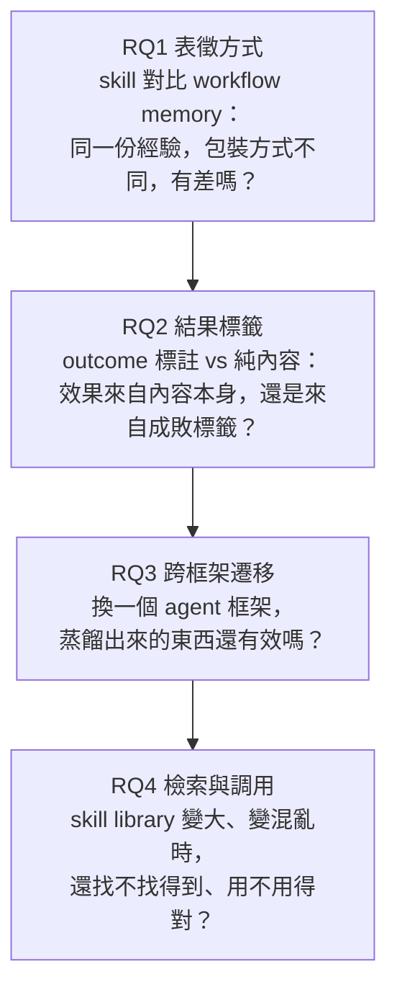
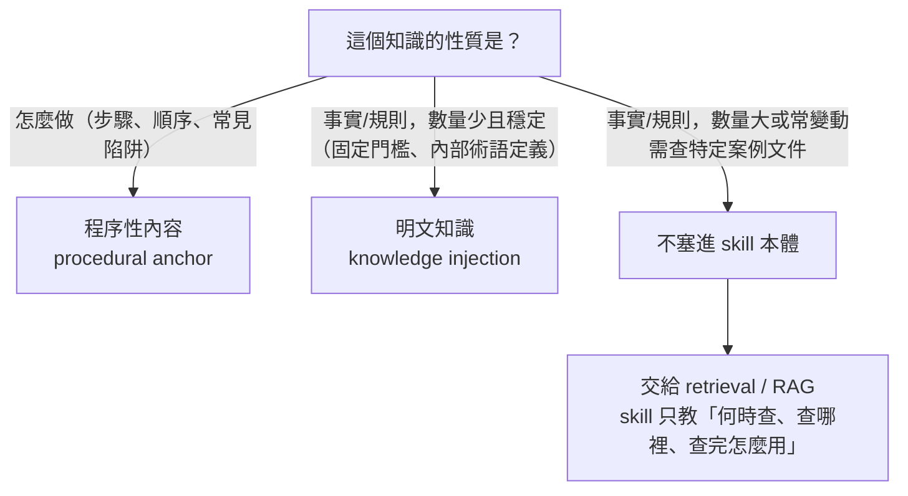

# Demystifying Agent Skills: Why They Work—Until They Don't — 精讀筆記

> arXiv 2608.14036v1，Princeton / Stanford / USC / Johns Hopkins，2026 年 8 月

## 30 秒版本

這篇論文回答的問題是：agent skill（像 Anthropic 那種 SKILL.md 格式的可重用程序知識包）**為什麼有效、什麼時候失效**，而不是單純問「有沒有效」。它用一套「同一個任務、三種條件（沒有先驗經驗 / 給原始執行紀錄 / 給蒸餾過的 skill）配對比較」的分析方法，把 skill 的效果拆解到「哪個環節改變了」的層級。

**一句話判斷**：這篇論文的核心價值是方法論本身（配對比較設計 + 兩階段標籤分類法），可以直接遷移到自己的 eval 系統；具體發現裡最站得住腳的是「procedural anchor（給步驟）遠比 knowledge injection（給知識）更能解釋 skill 的效果」，但「skill 顯著優於完全不給任何先驗經驗」這個 headline 級主張，論文自己算出來的統計信賴區間其實**不顯著**（詳見〈核心發現 A〉）——這點跟論文標題／摘要給人的印象有落差，是讀這篇論文最容易被誤導的地方。

## 你在討論過程中問的關鍵問題（可以直接跳讀）

這些問題是讀這篇論文時最容易卡住、也最值得記住的地方，每一個在下面對應章節裡都有獨立標記的方框，可以不看論文本身直接讀懂：

1. 【方法論】Agent transcript／Raw arm／Workflow arm／Skill arm 到底分別是什麼？
2. 【方法論】8,135 筆資料的三種切法怎麼理解？為什麼有些數字剛好對得上？
3. 【方法論】Open coding 那一步，具體要求 LLM 輸出什麼格式的東西？
4. 【核心發現 A】企業內部知識庫場景：如果 skill 只寫程序性內容，agent 沒有 private domain knowledge，還是會犯錯吧？
5. 【核心發現 A】Mode 這個標籤，是每一筆 trajectory 各自標一個，還是整組三方比較共用一個？
6. 【核心發現 A】Skill 修不好「演算法邏輯錯誤」「只做靜態驗證」這類問題，如果在 skill 裡面明確提醒驗證，會不會有幫助？
7. 【核心發現 A】Skill 引入的新失敗面（10% 的「被誤用/忽略」）這個數字，真的能證明是 skill 本身的問題嗎？
8. 【核心發現 C】檢索實驗裡，pool 只有 5 個候選時，三種方法的 precision 為什麼一開始就差這麼多（88.3% vs 70.0% vs 29.6%）？
9. 【核心發現 C】Pool 從 5 放大到 100，為什麼 Arm 3（實際執行）的 precision 崩得比另外兩組兇這麼多？

## 這篇論文想解決什麼問題

### 現有評估方式的缺口

目前評估 agent skill 的方式幾乎都是「黑箱式」的——給 agent 一批 skill，看解題成功率有沒有變高。有變高就說 skill 有用，沒有解釋**為什麼**有用。這種評法回答不了三個實務上關鍵的問題：

1. Skill 到底改變了 agent 行為的**哪個環節**？
2. 同一個 skill，為什麼在 A 任務有效、在 B 任務反而有害？
3. Skill 有效，是因為它提供了**新知識**，還是因為它把行為**固定下來**（哪怕內容本身沒什麼新資訊）？

這也是為什麼論文標題是「why they work — until they don't」，重點放在**機制**，不是「有沒有用」。

### 四個研究問題：對應 skill 從產生到被使用的完整生命週期

論文把「skill 為什麼有效」拆成四個階段，每個 RQ 對應一個階段，並且都用「固定其他變因、只變一個」的方式做控制實驗：



- **RQ1、RQ2** 問的是「經驗怎麼被包裝與標註」
- **RQ3、RQ4** 問的是「包裝完的 artifact，到了下游要怎麼被使用」

四個問題串起來看：**RQ1 問「怎麼包裝」、RQ2 問「包裝裡裝的是什麼在起作用」、RQ3 問「這個包裝能不能帶著走」、RQ4 問「東西變多之後找不找得到、用不用得對」**——剛好對應 skill 從「產生」到「被檢索」到「被實際調用」的完整生命週期。

> **☆ 你問的問題 1：Agent transcript／Raw arm／Workflow arm／Skill arm 到底分別是什麼？**
>
> 這四個詞在論文裡反覆出現，先定義清楚：
>
> | 詞 | 定義 | 作用 |
> | --- | --- | --- |
> | **Agent transcript** | 一次 trial 執行的完整過程記錄——agent 下了哪些終端機指令、呼叫了什麼工具、產生了什麼推理過程可見的文字、程式輸出是什麼 | 是後續「這筆為什麼成功/失敗」判斷的主要證據來源 |
> | **Raw arm** | agent 完全沒有拿到任何先驗經驗（沒有 workflow memory、沒有 skill），從零開始解題 | 對照組的 baseline 表現 |
> | **Workflow arm** | agent 拿到的是**清理過的原始 trajectory**，直接當作程序記憶插入 | 測「不特別包裝、只是把過去的執行紀錄丟給它」有沒有用 |
> | **Skill arm** | agent 拿到的是**同一批** trajectory，但蒸餾成標準化的 SKILL.md（有步驟、檢查清單那種格式） | 測「把經驗包裝成標準格式」跟 workflow 比有沒有差 |
>
> Raw / Workflow / Skill 這三個 arm 是全篇最核心的三個對照條件，之後每一節都會用到。

## 方法論：怎麼從一堆雜亂的執行紀錄，變成「skill 改變了什麼」這種可以下結論的分析

這一節只需要抓大方向，不需要記住每個實作細節：

1. **資料正規化**：把三個 benchmark（Terminal-Bench 2.0、SkillsBench、Terminal-Bench-Pro）、三種 arm（raw/workflow/skill）、六種先驗經驗組成比例（5s0f 到 0s5f，代表「5 個成功案例 0 個失敗案例」到「0 個成功 5 個失敗」）的執行紀錄，統一整理成一張 8,135 筆的資料表。成功／失敗一律用 **verifier 給的客觀 reward** 判定（正數才算成功），不採信 agent 自己的說法。
2. **Open coding（開放編碼）**：從 8,135 筆裡分層抽樣 240 筆，讓 LLM 不套用預設分類、自由產生短標籤，得到 238 筆有效標籤。這一步的精神是「先讓資料自己講話，不要先射箭畫靶」。
3. **兩階段分類法歸納**：把 238 個自由標籤，先分批（每批約 60 筆）各自歸納出批次分類，再把「批次分類的名稱+定義」（不重新讀原始資料）送進第二輪合併，收斂成 **12 個正式分類（mode）**，並分成三大類：SC1（成功的程序引導）、SC2（執行層與驗證失敗）、SC3（調用與邊界失敗）。這套分類法經過人工驗證：238 筆標籤的 grounding 全數通過（714 次抽查），分類一致性 95.8%、Cohen's κ = 0.952（這個指標的細節之後再展開討論）。
4. **528 組三方配對比較**：對每個 benchmark×task，湊出一組「raw／workflow／skill 三胞胎」，同一任務的三種版本放在一起比。LLM judge 同時看三筆 trajectory，除了幫每一筆各自標 mode，還要標**機制標籤**（procedural\_anchor／knowledge\_injection／failure\_warning／none／counterproductive），並記錄「這個處理修好了哪些失敗模式、又引入了哪些新的失敗模式」。

**關鍵判斷依據**：528 組 triple 這套分析管線的目的，是要回答「skill 改變了 agent 行為的哪個環節」這種機制層級的問題，所以只有跟「行為為什麼變」有關的〈核心發現 A〉章節需要用到它。〈核心發現 B（跨框架遷移）〉〈核心發現 C（檢索與下游執行）〉問的是不同性質的問題（跨框架還有效嗎、找不找得到、標籤重不重要），這些問題只需要成功率或檢索精準度這種聚合指標就能回答，不需要逐筆分類「這次失敗屬於哪個 mode」，所以論文乾脆另外設計獨立實驗去測，沒有重複套用分類法管線。

> **☆ 你問的問題 2：8,135 筆資料的三種切法怎麼理解？**
>
> 這批資料可以用三個互相獨立的角度去切，每個角度各自加總都等於 8,135（原文 Table 7）：
>
> ```
> 角度一：按 benchmark 切
>   Terminal-Bench 2.0   3,254
> + Terminal-Bench-Pro   2,993
> + SkillsBench          1,888
> = 8,135
> 
> 角度二：按 execution arm 切
>   Raw arm               1,883
> + Workflow memory arm   2,658
> + Skill arm             3,594
> = 8,135
> 
> 角度三：按結果切
>   成功  4,541
> + 失敗  3,594
> = 8,135
> ```
>
> 三種切法是同一個池子的三種不同分類方式（像同一班學生，可以按班級分、按性別分、按及格/不及格分——三種切法各自加總都等於全班人數，但彼此之間沒有誰包含誰的關係）。
>
> 另外還有三個數字，屬於「資料完不完整」的計數，不是分類：有 agent transcript 可用的 7,837 筆、有 task instruction 可用的 6,210 筆、skill arm 裡有連結到 skill 檔案的 3,570 筆。
>
> **陷阱提醒**：Skill arm（3,594）跟失敗數（3,594）數字剛好一樣，Raw+Workflow（1,883+2,658=4,541）也剛好等於成功數（4,541）——**這是巧合，不是因果關係**。Arm 跟結果是兩個互相獨立的維度（事實上 skill arm 的成功率是三個 arm 裡最高的，61.9%）。看到表格數字剛好對上時，先確認是不是巧合，別急著讀出關聯性。

> **☆ 你問的問題 3：Open coding 那一步，具體要求 LLM 輸出什麼？**
>
> 不是自由文字分析，而是固定結構的 JSON：
>
> ```json
> {
>   "freeform_reasoning_short": "1-2 句話摘要發生了什麼事",
>   "primary_mode_candidate": "開放式短標籤，例如 'missing python dependency'",
>   "secondary_factors": ["次要影響因素"],
>   "evidence_spans": [{"source": "codex.txt", "quote": "逐字擷取，<=160字元"}],
>   "skill_effect_judgment": "helps | neutral | hurts | not_applicable",
>   "skill_effect_reason": "一句話",
>   "capability_vs_knowledge": "knowledge_missing | knowledge_present_but_misused | capability_limit | environmental"
> }
> ```
>
> `primary_mode_candidate` 是這一步的核心——刻意留開放式，讓詞彙自然浮現，而不是從預設選單挑。
>
> **論文交代不清楚的地方**：如果一筆 trajectory 是「乾淨的一次成功，過程中完全沒有用錯再修正」，`capability_vs_knowledge` 這個欄位該填哪個選項？論文只講了「如果成功了，可以填 knowledge\_present\_but\_misused，但前提是 agent 曾經用錯過、後來自己修正回來」——但四個選項（missing／misused／capability\_limit／environmental）沒有一個字面上對應「知識存在且一次用對」。這是論文原文沒講清楚的空隙，不是被忽略了才沒寫。

## 核心發現 A：Skill 為什麼有效——Procedural Anchor 機制（RQ1 + RQ2）

### 內部一致性檢查：兩套成功率互相印證

論文用兩套獨立算出來的成功率互相對照：

| 名稱 | 怎麼算 | Skill／Raw／Workflow |
| --- | --- | --- |
| Oracle-status success rate | 直接用 verifier reward 判定（客觀、二元） | 61.9% ／ 59.1% ／ 55.9% |
| Taxonomy-mode successful-procedure proportion | 528 組配對裡，LLM judge 把該筆歸到 SC1（成功程序引導）的比例 | 61.7% ／ 59.1% ／ 55.7% |

兩組數字幾乎一模一樣（差距都在 0.2 個百分點以內）——這代表分類法標出來的「這筆算不算成功」，跟 verifier 的客觀判定是一致的，值得信任，後面的機制數字才站得住腳。

### 核心數字：procedural\_anchor 遠大於 knowledge\_injection

528 組配對裡，每一筆 workflow／skill 除了標 mode，還要另外標一個**機制標籤**，回答「這個 artifact 是怎麼影響這次執行的」：

| 機制標籤 | 意思 |
| --- | --- |
| `procedural_anchor` | 給了可執行的程序：步驟順序、檢查清單、工具呼叫序列 |
| `knowledge_injection` | 補了 agent 原本缺的具體領域知識 |
| `failure_warning` | 提醒了某個會踩到的陷阱，agent 因此避開 |
| `none` | 這份 artifact 根本沒被實際用到 |
| `counterproductive` | 誤導了 agent，讓結果變更差 |

**procedural\_anchor 佔 skill 機制的 65.7%，knowledge\_injection 只佔 4.5%**（剩下約 29.8% 分布在另外三個標籤裡，論文全文沒有給出這三者的個別精確比例——這是論文沒交代清楚的地方）。

換算一下：skill 成功發揮作用的案例裡，大約每 3 筆就有接近 2 筆是靠「給步驟」在幫忙，每 22 筆才有 1 筆是靠「給知識」在幫忙（65.7/4.5 ≈ 14.6 倍）。

**具體例子**（論文附錄 A.3，`react-performance-debugging` 任務，SkillsBench，1s4f 設定，skill arm，reward=1 成功）：注入的 SKILL.md 內容是 *"Start promises early, await late"*（提早發起 promise，晚一點再 await），agent 依此把 checkout 路由裡原本依序等待的兩個 API 呼叫，改成部分平行化：

```javascript
// Skill 引導下的最終修正版本
export async function POST() {
  const userPromise = fetchUserFromService();
  const configPromise = fetchConfigFromService();
  const user = await userPromise;
  const profilePromise = fetchProfileFromService(user.id);
  const [config, profile] = await Promise.all([
    configPromise,
    profilePromise,
  ]);
  return NextResponse.json({
    success: true,
    user: { id: user.id, name: user.name },
    profile,
    config: { currency: config.currency },
  });
}
```

最後 11 項驗證測試全過。這**不是**在教 agent 什麼領域知識（agent 本來就知道 `Promise.all` 語法），而是在告訴它「遇到這類情境時，該用哪種操作順序」——這就是典型的 `procedural_anchor`（這是根據論文給的例子對應機制定義做的判斷，論文原文沒有明講這筆的機制標籤是什麼，但從內容特徵看這樣分類是合理的）。

**這個發現最重要的解讀**：skill 之所以有效，主要不是因為它把 agent 原本不會的東西教會了它，而是因為它把 agent 本來就會、但容易做得不穩定的行為給「固定」下來——該先跑哪個檢查、工具要照什麼順序呼叫、中間要驗證什麼。

> **☆ 你問的問題 4：企業內部知識庫場景，skill 只寫程序性內容，agent 沒有 private domain knowledge，還是會犯錯吧？**
>
> 這個懷疑是對的，需要修正的不是「65.7% vs 4.5%」這個數字本身，而是「這個數字能不能直接套用到企業內部場景」——答案是不能直接套用。
>
> 論文用的三個 benchmark（Terminal-Bench、SkillsBench、Terminal-Bench-Pro）都是終端機操作、debug、API 呼叫這類任務，這些任務需要的知識幾乎都是公開、agent 訓練時大機率已經看過的東西。所以 agent 卡關通常不是因為「不知道」，而是「知道但沒有穩定照著對的順序做」——這正是 knowledge\_injection 只有 4.5% 的根本原因：不是知識注入沒用，是這批任務裡本來就沒什麼真正缺的知識可以注入。
>
> 企業內部知識庫場景完全不同：內部系統代號、特定業務規則、專有門檻值——這些東西無論 skill 步驟寫得多標準化，agent 在該填入具體資訊的那一步，還是會憑空腦補或用錯。論文完全沒有測試到這種場景。邏輯上很直接：**procedural anchor 解決的是「知道但做不穩」，解決不了「真的不知道」**。
>
> 一個可以直接拿來用的判斷框架（這是根據前面機制定義推導出來的延伸，不是論文原文）：
>
> ```mermaid
> flowchart TD
>     Q["這個知識的性質是？"]
>     Q -->|"怎麼做（步驟、順序、常見陷阱）"| A["程序性內容<br/>procedural anchor"]
>     Q -->|"事實/規則，數量少且穩定<br/>（固定門檻、內部術語定義）"| B["明文知識<br/>knowledge injection"]
>     Q -->|"事實/規則，數量大或常變動<br/>需查特定案例文件"| C["不塞進 skill 本體"]
>     C --> D["交給 retrieval / RAG<br/>skill 只教「何時查、查哪裡、查完怎麼用」"]
> ```
>
> 也就是說，企業 skill 大概率需要同時具備「程序骨架」跟「明確知識」兩塊——論文不是叫你只寫前者，只是在說「在他們測的這批任務裡，光有骨架就贏了大部分場」。

### Skill 不是唯一有效的方式——Workflow memory 只是贏得比較「髒」

兩個成功類 mode（都屬於 SC1）：`skill_guided_success` 在 skill arm 裡佔 61.6%，`workflow_guided_success` 在 workflow arm 裡佔 54.5%——**兩個都不低**，workflow memory 本身有相當高的機率讓 agent 抄對答案，不是沒用的東西。

差別在「乾淨度」：workflow memory 保留的是比較接近原始執行過程的內容，裡面夾雜著跟這次任務無關的探索、走過的死路、沒用上的嘗試。這些雜訊不會讓 agent 完全學不到東西（所以還是有 54.5% 成功率），但會拖累——agent 得多花力氣過濾雜訊，容易導致超時（下面會展開）。Skill 則是蒸餾過的版本，把探索過程、失敗嘗試都剪掉，只留下「這樣做會成功」的部分。

**如果系統打算保留「原始執行紀錄」這種形式的記憶，根據這個發現，它不是沒有用，但該預期它比蒸餾過的 skill 更容易造成 agent 讀太多、抓不到重點、進而拖慢或跑偏。**

### Skill 的能力邊界：治得好「粗心」，治不好「不會」

SC2（執行層與驗證失敗）大類的整體佔比：raw 37.3%、workflow 33.3%、skill **23.5%**。拆開看，skill 對不同類型 SC2 失敗的效果差很大：

**壓制得很乾淨的（環境／流程類，容易「忘記」型的失敗）：**

| Mode | raw | workflow | skill |
| --- | --- | --- | --- |
| 環境／基礎設施失敗 | 5.3% | 1.7% | **0.2%**（降了 26 倍） |
| 輸出格式不符 | 7.4% | 3.8% | 3.2% |
| 背景服務生命週期失敗 | 2.7% | 2.5% | **0.8%** |

**幾乎沒改善的（深層推理／驗證類，靠判斷力的失敗）：**

| Mode | raw | workflow | skill |
| --- | --- | --- | --- |
| 演算法邏輯錯誤 | 8.3% | 11.0% | 7.4% |
| 只做靜態檢查、沒跑 runtime | 12.5% | 12.5% | **11.7%**（三個 arm 幾乎沒差） |

**為什麼會這樣**：procedural anchor 的作用是固定「本來就會、但容易做得不穩」的行為。但演算法寫錯、該跑實際測試卻只做表面檢查，這兩件事的根源是 agent 當下的推理／判斷能力本身不夠——skill 沒辦法把一個寫錯的演算法變對，這是 procedural anchor 這個機制本身的天花板，不是 skill 這個工具用得不好。

> **☆ 你問的問題 6：Skill 修不好這類問題，如果在 skill 裡明確寫「記得驗證」，會不會有幫助？**
>
> 這裡有一個值得修正的地方：skill-creator 產生 SKILL.md 時，**格式上本來就固定要求輸出一個 `## Verify` 段落**（怎麼確認這個 skill 執行成功）。也就是說，論文實驗裡的 skill，格式上本來就內建了「驗證步驟」這個提醒——這個做法某種程度上已經被實際測過了，不是完全沒試過的假設。
>
> 但結果還是 12.5% → 12.5% → 11.7% 這組幾乎沒動的數字，這就更值得深究：跟環境失敗那組（5.3%→0.2%）比，兩者的差別可能不在「有沒有寫提醒」，而在「這個提醒是不是能被機械式地執行」：
>
> |  | 環境設置類指令 | 驗證類指令 |
> | --- | --- | --- |
> | 典型內容 | 「先跑 `npm install`，再跑 `npm run build`」 | 「跑完後執行 runtime 驗證確認結果」 |
> | 執行方式 | 照抄指令、照順序執行 | 要自己判斷「測試設計得夠不夠嚴謹」「輸出結果算不算真的通過」 |
> | 出錯空間 | 幾乎沒有模糊地帶 | agent 可能跑了測試，但寫得太鬆、或只看部分輸出就結案 |
>
> （這是根據觀察到的規律做的推論，論文沒有明講這個機制。）
>
> **論文沒告訴我們的資料缺口**：論文沒有拆分「這個 mode 底下的案例，用的 skill 到底有沒有寫進具體的驗證提醒」——只知道格式上有 `## Verify` 欄位，不知道每個實際生成的 skill，那個欄位寫得夠不夠具體、有沒有被 agent 認真執行。所以「skill 裡明確提醒驗證有沒有用」這個問題，論文的資料不足以完全證實或推翻。

### Skill 引入的新失敗面

SC3（調用與邊界失敗）大類，skill arm 明顯最高（78/528 ≈ 14.8%，raw 只有約 3.6%）。拆開看兩個關鍵 mode：

| Mode | raw | workflow | skill |
| --- | --- | --- | --- |
| skill 指引被誤用或忽略 | 0.8% | 0.4% | **10.0%** |
| 逾時／預算耗盡 | 1.7% | **10.6%** | 4.4% |

兩種失敗方式性質不同：**skill 的失敗是「內容乾淨，但 agent 用歪了」**（`skill_guidance_misapplied_or_ignored`——skill 給了合理指引，但 agent 機械式照搬、漏看適用條件、或把不再成立的假設也搬過去用）；**workflow 的失敗是「內容太雜，agent 來不及讀完就先燒完預算」**（呼應前面講的「乾淨度」問題）。

> **☆ 你問的問題 7：這個 10% 的「被誤用/忽略」數字，真的能證明是 skill 本身的問題嗎？**
>
> 這裡需要收回一個講得太滿的結論。最初的說法是「這是 skill 帶來的新失敗面，值得在設計時特別注意」——但這個講法的證據力其實比呈現的弱很多，需要拆開來看：
>
> **合理的部分**：如果純粹是「agent 是機率模型，本來就會隨機犯錯」，你會預期這種誤用錯誤在三個 arm 之間大致平均分布。但實際上差了 12～25 倍（raw 0.8%、workflow 0.4%、skill 10.0%），而且集中在 skill arm——這個「差異集中」的現象，光用「模型是機率性的」解釋不完，因為 workflow arm 同樣有給指引內容（甚至內容量通常更大），理論上也該有類似比例才對，但它反而是三者最低。
>
> **站不住腳的部分**：這個 mode 的名字本身就叫 `skill_guidance_misapplied_or_ignored`——字面上就綁定「skill」這個詞。當 LLM judge 在標 raw／workflow arm 時，理論上沒有「skill」可以被誤用，那 0.8%／0.4% 這兩個非零數字到底是怎麼被標出來的、標準是什麼，論文完全沒解釋。**這代表這個 mode 的分類標準，可能本身就對 skill arm 有系統性偏好**——不是三個 arm 用同一把尺客觀量出來的差異，可能有部分是分類法設計時就帶著的傾向性。論文也沒有做任何實驗去區分「這 10% 是壓縮抽象化造成的過度套用」跟「這 10% 就是模型隨機犯錯、剛好被貼上這個標籤」，這兩種解釋論文的資料沒辦法幫你排除其中一個。
>
> **誠實的結論**：這 10%「有一個標籤使用率偏高」是真的，但它反映的到底是「真實的機制差異」還是「分類法本身的定義偏誤」，論文的資料不足以讓我們判斷是哪一種。

## 核心發現 B：跨框架遷移（RQ3）

這一節完全獨立於前面的 528 組配對分類法，純粹比較成功率。

**實驗設計**：用 Codex + GPT-5.3-Codex 產生的 workflow memory 跟 skill（原封不動、同一批 artifact），拿去 Gemini CLI + Gemini-3.1-Pro-Preview 上執行。來源經驗固定不變，只換執行的 agent 框架（prompting 風格、工具介面、執行迴圈都不同）。

**原文 Figure 4**（caption：*Cross-framework transfer of procedural experience. Prior-experience artifacts constructed in one agent framework are evaluated in another. Dashed lines indicate the target framework's Raw baseline.*）：一張長條圖，x 軸是建構先驗經驗時用的 trajectory 組成比例（0s5f 到 5s0f，六種），每個比例下有兩根長條——橘色是 workflow memory、綠色是 skill；圖上有一條橫向虛線，標示目標框架（Gemini）在完全沒有先驗經驗時的 raw 基準線 56%。

實際數字：

```
Trajectory mixture:  0s5f  1s4f  2s3f  3s2f  4s1f  5s0f
Workflow memory:      60    58    60    56    70    54
Skill:                 62    76    76    76    74    84
Raw baseline (Gemini): 56（全部比例下都一樣，橫線）
```

**核心發現**：Skill 全程穩定贏過 raw 基準線（62%～84%，最低點也比 56% 高），workflow memory 卻不穩——在 3s2f 時打平（56% = 56%），在 5s0f 時甚至跌破 raw 基準線（54% < 56%）。也就是說：**把原始 trajectory 直接搬到另一個框架，有時候比完全不給任何先驗經驗還糟**；蒸餾過的 skill 則從沒發生這種情況。這是「skill 比 workflow memory 更能跨框架搬」這個結論的具體數字證據。

**論文沒解釋的異常點**：5s0f（全部都是成功案例做出來的先驗經驗）理論上內容品質應該最好，但 workflow memory 在這個設定下反而是六個裡面表現最差的（54%）；同一個設定下 skill 卻是表現最好的（84%，也是全圖最大差距 +30 的地方）。論文沒有解釋為什麼「全成功案例」建出來的 workflow memory，換框架後反而最不 portable——這是原文交代不清楚的地方。

## 核心發現 C：檢索與下游執行（RQ4）

跟核心發現 B 一樣，這一節不用 528 組配對分類法，用 SkillsBench 自帶的 task-skill 正解標註來算 precision/recall/F1。

### 三組獨立實驗——先分清楚「找不找得到」跟「用不用得到」是兩件事

每個任務配一個 candidate pool（1 個正解 skill + k-1 個干擾項，k 從 5 測到 100）。三組實驗互相獨立，彼此的輸出不會傳給下一組：

```
Arm 1：embedding 檢索
  → 純算法：用 Qwen3-Embedding-0.6B 把任務描述跟每個 skill 描述都轉成向量，
    算 cosine similarity，排名最高的當作「選中」（分母固定 = 1）
  → agent 完全沒有介入，也沒有真的去執行任務
  → 測的是：「用最陽春的語意相似度排序，選不選得中正解？」

Arm 2：agent 明確選擇
  → 把整個 candidate pool 的清單（名稱+描述）攤給 agent 看，
    問它「你會選哪幾個」，但不執行下游任務（分母 = agent 自己明確選出的數量）
  → 測的是：「agent 自己讀完候選清單，判斷得出哪個有用嗎？」

Arm 3：實際執行
  → 整個 candidate pool 直接放進 agent 的執行環境裡，不事先篩選，
    agent 自己邊解題邊決定要不要打開哪個 skill 來看
    （分母 = agent 在真實解題過程中，實際打開/呼叫過的 skill 種類數）
  → 事後解析 trajectory，看它實際「用到」了哪些 skill，連同最後有沒有成功
  → 測的是：「在真實解題過程中，agent 到底用了什麼、有沒有用對，
    以及任務最後有沒有成功」
```

Arm 1、Arm 2 問的是「離線的識別能力」，不牽涉實際解題；Arm 3 問的是「線上、真實執行時的使用行為」，這才會連到任務成功與否。

> **☆ 你問的問題 8：pool size = 5 時，三種方法的 precision 為什麼就差這麼多（88.3% vs 70.0% vs 29.6%）？**
>
> 差異的根源是三種方法的「分母」定義完全不一樣：
>
> - **Arm 1**：分母固定是 1（只挑相似度最高的那一個）。候選很少時，語意最相近的通常就是對的，所以 88.3% 起點就很高。
> - **Arm 2**：分母是 agent 自己明確選出的數量。它不會照單全收（不然分母被拖大），而是憑判斷力挑出它覺得相關的那幾個，70.0% 代表挑的這批裡七成猜對。
> - **Arm 3**：分母是 agent 在**沒有被要求要精簡**的情況下，真實解題過程中自然會去嘗試翻閱的候選數量——就算 pool 只有 5 個，agent 也很可能因為不確定、想多方嘗試，而翻看了不只 1 個。29.6% 大概對應到「平均每次翻看的候選裡，正解只占了不到三分之一」。
>
> 一句話：Arm 1、Arm 2 測的是「事先篩選的準頭」（分母被人為壓小），Arm 3 測的是「解題過程中真實翻閱行為的準頭」（分母是自然產生、比較雜的）——不是 Arm 3 的方法比較差，是它問的問題本身就跟 Arm 1/2 不一樣。

### 核心反直覺發現：precision 崩盤，但成功率幾乎沒動

Pool 從 5 放大到 100，三組 precision 的變化：

```
Arm 1（embedding 檢索）   ：88.3% → 76.9%   （小幅下降）
Arm 2（agent 明確選擇）   ：70.0% → 63.7%   （小幅下降）
Arm 3（實際執行，用到什麼）：29.6% → 3.3%    （崩盤式下降，將近 9 倍）
```

但同時，**Arm 3 的下游任務成功率**：從 36.4% 只掉到 39.3%——不只沒有崩，甚至還微幅上升。選不選得中「標準答案」skill，跟任務最後做不做得出來，居然幾乎是兩件不相關的事。

**為什麼**：關鍵是 recall 撐住了。Pool size = 100 時，Arm 3 的 **recall 仍有 54.3%～73.6%**，precision 卻只剩 0.7%～8.1%。也就是說，agent 雖然在解題過程中東摸西碰、碰過一大堆不相關的 skill（precision 低），但正解 skill 本身，agent 大部分時候還是有摸到（recall 高）——只是被淹沒在一堆雜訊裡而已。

論文原文的判讀：*"exact ground-truth skill invocation is neither sufficient nor strictly necessary for success"*——精準只叫用正解 skill，既不是成功的充分條件（就算叫對了 skill，agent 執行判斷力不夠一樣會失敗，呼應核心發現 A 講的能力邊界），也不是必要條件（就算沒有精準鎖定正解、摸了一堆不相關候選，只要正解有被摸到過、加上其他相關 skill 有時候也能提供類似幫助，任務照樣做得出來）。

### 誰才是真正的壓力來源：pool 變大 vs 干擾項像不像正解

Table 4 拆開三種干擾項情境（random／similar／dissimilar），在 pool size = 100 時的 Arm 3 precision：

```
random 干擾項   ：4.4%
similar 干擾項  ：3.7%
dissimilar 干擾項：1.7%（居然是最低的！）
```

如果直覺是「因為干擾項太像正解，agent 分不清楚才多翻幾個」，那 dissimilar（一看就跟正解無關）應該崩得最少才對——但實際上它崩得反而更兇。這代表驅動 **Arm 3** precision 崩盤的主因，**不是「像不像」，是單純「pool 裡東西變多」這件事本身**。

反過來，**Arm 1、Arm 2** 的規律完全相反——真正讓它們崩的不是 pool 變大，是干擾項像不像正解：

```
Arm 1（embedding 檢索）precision，k=5 → k=100
  random     ：97.7% → 84.1%   （只掉 13.6pp）
  dissimilar ：96.6% → 93.2%   （只掉 3.4pp，幾乎沒掉）
  similar    ：70.5% → 53.4%   （掉 17.1pp，起點就低很多）
```

論文原文直接點出這個對比：*"similar distractors are the dominant stressor for the offline identification diagnostics \[Arm 1/2\], whereas Arm 3 precision collapses across all three regimes as the pool grows"*——離線檢索是被「像不像」卡住，Arm 3 是被「pool 大小本身」卡住，兩種機制不一樣。

> **☆ 你問的問題 9：Pool 變大時，Arm 3 precision 崩得比另外兩組兇這麼多，是因為 agent 想做更多探索嗎？**
>
> 方向大致對，但有一個字需要修正：不是「探索」（隱含 agent 主動決定要多方嘗試），比較準確的講法是「環境變大、自然摸到更多」——論文的資料只能支持「pool 變大時，agent 實際碰過／叫用過的 skill 種類數自然變多」這個**現象**，沒有證據顯示這是 agent **刻意決定**要探索更多。論文自己也沒有完全講清楚為什麼會這樣（只呈現了現象，沒有做進一步的行為分析）。
>
> 修正後完整的因果鏈：**pool 變大 → 環境裡候選變多 → agent 解題過程中自然接觸／叫用到的候選數變多（不一定是主動探索）→ precision 分母被稀釋 → precision 崩盤**。而且如上一節講的，這個崩盤跟干擾項「像不像正解」關係不大（dissimilar 反而崩最兇）——真正的驅動力是 pool 規模本身，這一點在 Arm 1/2 身上不成立（那邊是被「像不像」卡住），是 Arm 3 獨有的模式。

### 完整因果圖景

```
離線檢索／選擇（Arm 1、Arm 2）
  → 壓力來源：干擾項「像不像正解」（語意混淆）
  → pool 單純變大、但干擾項好分辨 → 影響有限

實際執行（Arm 3）
  → 壓力來源：pool「有多大」本身
  → 不管干擾項像不像，agent 解題過程摸過的候選種類數都會被稀釋
  → 但因為 recall 撐住（agent 大多還是有摸到正解），成功率沒有跟著崩
```

一個 Table 4 裡的細節：k=100 時的 selection recall（Arm 2）仍有 70.5%～85.2%，論文的解讀是「agent 常常會把正解 skill 跟一堆干擾項一起選進去，而不是完全漏掉它」——這跟 Arm 3 recall 撐住是同一種模式，只是這裡是「選擇」層級，那裡是「執行」層級。

## 補充分析：outcome 標籤重不重要 + token cost trade-off（略讀版）

### No-hint 消融：標籤本身是關鍵訊號

**問題**：skill 建構時，如果不告訴它「這批 trajectory 哪些是成功案例、哪些是失敗案例」，效果會差多少？

**結論**：當來源全是成功案例時，有沒有標籤差別不大；但只要摻進失敗案例，有標籤（normal）明顯優於沒標籤（no-hint），而且失敗案例摻得越多，差距通常越大。代表性數字：Gemini 在 Terminal-Bench-2、3s2f 設定下，normal 是 74.6%，no-hint 只有 40.0%，差了將近一倍。

意涵：「這是成功還是失敗的案例」這個標籤本身，是 skill 能不能從失敗案例裡正確提煉「不要這樣做」的關鍵訊號——這反過來印證了核心發現 A 的結論：skill 的價值主要來自「把行為固定住」，而「固定對的行為、避開錯的行為」這件事，本身高度依賴這個明確的成敗標籤。

### Token cost trade-off

限定條件：這段分析只用 83 個「三個 arm 都有完整 token 記錄」的任務子集（原文 Table 13），不是全部 8,135 筆。

```
Raw         ：成功率 64.1%，總 token 555.7K
Workflow    ：成功率 64.8%，總 token 426.2K（比 raw 省 23%）
Skill       ：成功率 69.6%，總 token 521.5K（比 raw 省 6%，但比 workflow 多花 22%）
```

結論：workflow memory 最省 token 但效果普通；skill 效果最好、比 raw 省一點 token，但比 workflow 貴不少——論文的定調是「skill 用多一點 context 換到明顯更高的成功率，這筆交易划算」。

## 值得帶走的東西

### 這篇論文自己的貢獻

這篇論文本身的「新知識」含量不算高，貢獻主要是方法論跟一組相對可信的相對比較，不是驚人的新機制發現：

- **最紮實的貢獻是方法論本身**：把「skill 有沒有用」從單一聚合成功率，拆成配對三方比較（raw/workflow/skill 同任務對照）+ 兩層標籤，可以直接遷移到自己的 eval 系統
- **統計上站得住的結論**：skill 顯著優於 workflow memory（+6.06 個百分點，95% 信賴區間 \[+0.76, +11.36\]，不含 0）；但 **skill vs raw 不顯著**（+2.84 個百分點，95% CI \[-2.27, +7.95\]，包含 0）——這是需要跟論文標題/摘要傳達的印象分開看的地方：論文真正站得住腳的統計結論是「skill 顯著贏過 workflow memory」，不是「skill 顯著贏過完全沒有先驗經驗」
- **procedural anchor（65.7%）遠大於 knowledge injection（4.5%）**——但這個比例是這批終端機/工具任務的特性，換到私有領域知識場景不能直接套用
- Skill 對「環境設置類」失敗壓制效果驚人（5.3%→0.2%），對「演算法邏輯錯誤」「只做靜態驗證」幾乎沒改善——procedural anchor 這個機制本身有能力邊界
- 跨框架遷移：skill 全程穩贏 raw 基準；workflow memory 有時比 raw 還差（尤其在最不該差的、全成功案例的 5s0f 設定）
- 檢索：pool 放大時 precision 崩盤但成功率不太受影響（因為 recall 撐住），且離線檢索（怕像不像）跟實際執行（怕 pool 多大）栽在不同的坑

### 脫離這篇論文也成立的東西

這些是討論過程中沉澱出來、跟這篇論文的具體結論無關、可以直接用在其他場合的東西：

**成功/失敗判定要綁在外部可驗證訊號上，不是模型自我報告。** 這篇論文用 verifier reward（正數才算成功）而不是 agent 自己講的「我做完了」來判定成敗，才讓後面所有分析站得住腳。任何拿 agent trajectory 做後續分析的 pipeline，都該遵守這條——不然整個分析的地基就不穩。

**Open coding（開放編碼）方法論：先讓資料自己講話，不要先射箭畫靶。** 這個詞借自社會科學的質性研究方法（grounded theory，紮根理論），原意是研究者逐行讀訪談稿，不套用預設類別，先讓每一段內容自己產生貼切的標籤，等標籤累積夠多再回頭歸納主題。這篇論文把「研究者逐行讀」換成「LLM 逐筆判讀 trajectory」。這套邏輯可以用在任何「你不確定資料裡實際有哪些模式」的分類任務上——如果自己坐下來先想一套分類法，很容易只想到自己預期會看到的模式，漏掉資料裡實際出現、但沒想過的型態。

**兩輪批次歸納法，是讓 LLM 分類任務規模化的實用工程模式。** 先分批各自產生候選分類（每批只看得到批次內的資料），再只用「分類名稱+定義」（不重新讀原始資料）送進第二輪合併——第二輪的輸入量因此大幅縮小，不需要重新處理所有原始資料。這個模式可以直接用在自己要做大規模標籤歸納的場合：不管是 agent trajectory 的失敗分類，還是任何需要從大量非結構化資料裡歸納出一套固定分類系統的任務。

**Precision 不等於下游成功率——先想清楚要問的是哪一種問題。** 這篇論文用血淋淋的數字證明了「選得準不準」和「任務做不做得出來」可以是兩件幾乎不相關的事（Arm 3 precision 崩盤 9 倍，成功率幾乎不動）。衡量一個系統時，要先想清楚指標到底是「識別準不準」（precision/recall，離線可測）還是「結果好不好」（success rate，需要真實執行），這兩者可能給出完全相反的優化方向——如果把資源全砸在把 top-1 檢索做到完美，可能是在優化一個跟最終結果關係不大的指標。

**企業內部知識該放進 skill 本體、還是交給 retrieval——一個可以直接用的判斷框架。**（這是根據論文機制定義做的延伸推論，不是論文原文）



判斷依據：procedural anchor 解決的是「知道但做不穩」，knowledge injection 解決的是「數量少、穩定的具體事實缺口」；數量大、常變動的知識，塞進 skill 本體會過期、會塞爆 context，該交給 retrieval，skill 只負責教 agent 什麼時候該查、查哪個知識庫、查完怎麼用。
