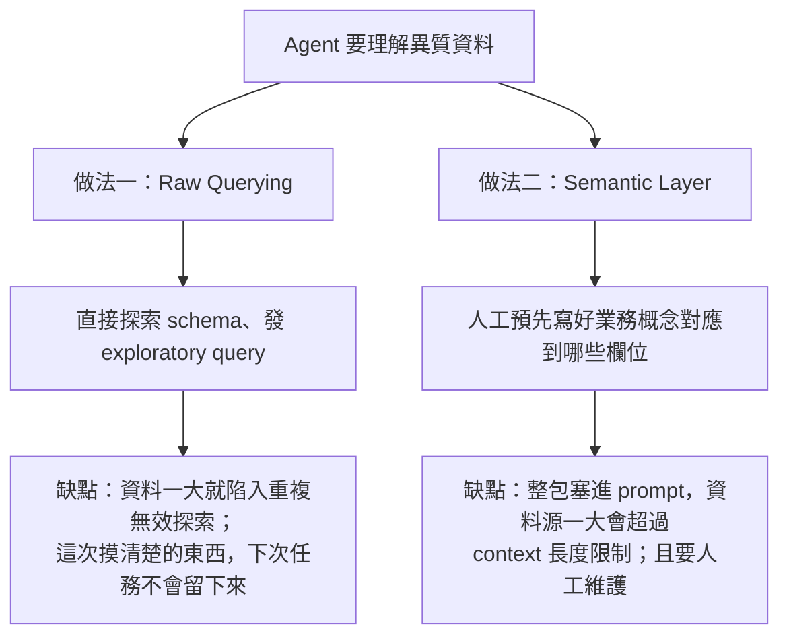
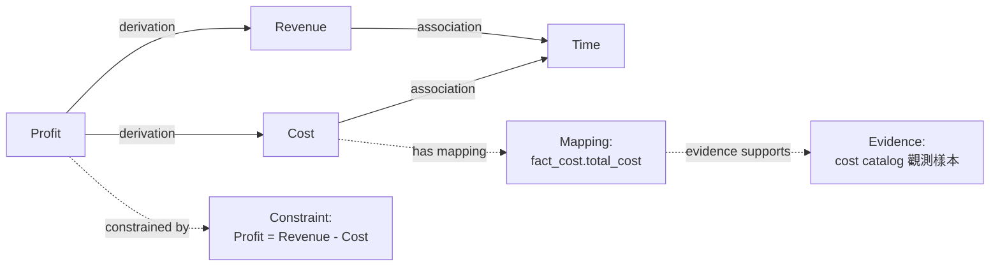
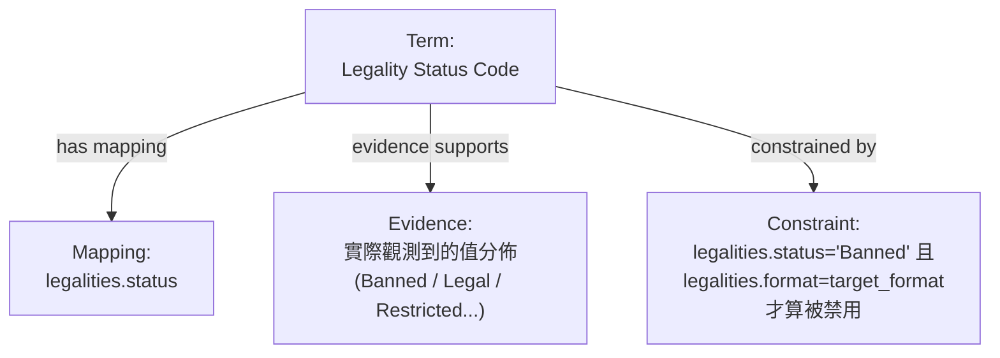
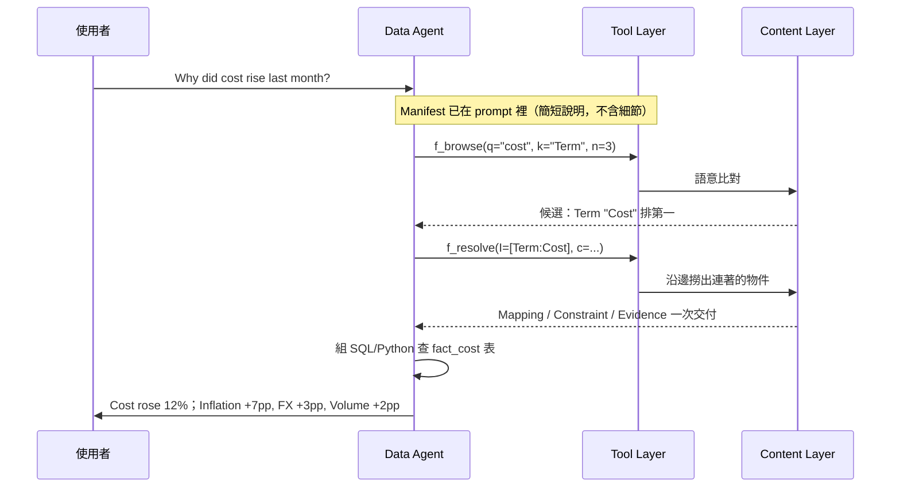
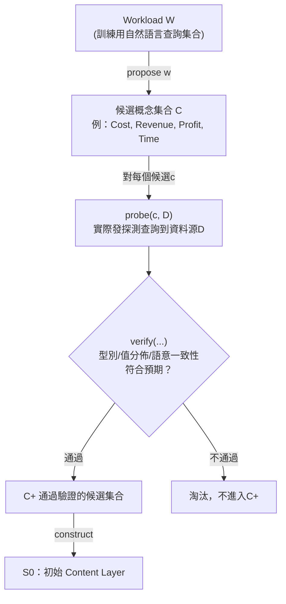
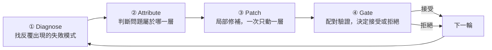
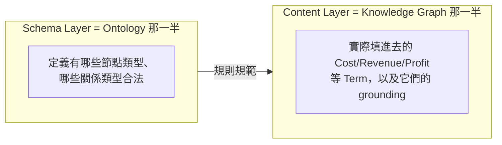
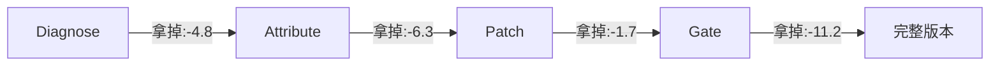
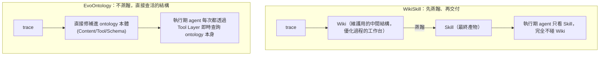

# EvoOntology 論文筆記：Self-Evolving Ontology Layer for Data Agents

Sep 24, 2026 · @YHHW

## 30 秒版本

**這篇論文在解決什麼**：AI agent 要處理異質資料（資料庫、CSV、文件、圖表、log）時，因為事前不知道資料的實際結構長什麼樣子，只能靠 SQL 介面、file reader 這類通用工具盲目摸索——這個落差稱為 **agent-data gap**。

**這篇論文怎麼解決**：在 agent 跟原始資料之間，加一層「ontology 層」——由 Schema Layer（規則）、Content Layer（結構化知識圖）、Tool Layer（查詢介面）三層組成，讓 agent 用工具呼叫（browse / resolve）主動查詢需要的知識，而不是把整包知識塞進 prompt。這層 ontology 還會透過一套「診斷失敗軌跡 → 局部修補 → 驗證後才接受」的自我演化迴圈持續變好。

**整體評價**：研究貢獻中等偏低——核心骨架（結構化知識層 + 從失敗軌跡歸因 + 驗證閘門）跟同類「agent 自我演化知識/技能庫」論文（例如 WikiSkill）在架構精神上同構，不是原創突破。但**工程／落地參考價值中高**：驗證閘門（候選 vs 父版本、同條件配對比較）的設計，以及「主動查詢優於整包塞 prompt」這個被乾淨驗證過的結論，都有直接遷移價值。缺點同樣明確：換一個 LLM backbone，整套演化出來的 ontology 幾乎要重跑一次（無法跨 backbone 遷移）；而且方法論段落在好幾個關鍵細節上語焉不詳（見下方各節的「論文沒交代清楚」標記）。

論文資訊：*EvoOntology: A Self-Evolving Ontology Layer for Data Agents*，Meiduo Chong, Shaolei Zhang, Ju Fan, Xiaoyong Du（Renmin University of China），arXiv:2609.15779v1，2026 年 9 月 14 日。

## 索引：值得跳讀的釐清與問答

這些是整理筆記時特別標記出來的段落——通常是原本容易搞混、或是論文本身沒講清楚的地方。想快速複習時可以直接跳到對應章節（用瀏覽器的頁內搜尋找標題即可）。

| # | 主題 | 位於哪一節 |
| --- | --- | --- |
| 1 | Evidence 跟 Constraint 差在哪 | 核心架構：Content Layer |
| 2 | Semantic Layer / OWL Ontology / dbt Semantic Layer 分別是什麼 | 深度問答集 |
| 3 | Ontology 跟 Knowledge Graph 到底差在哪（含一次框架修正過程） | 深度問答集 |
| 4 | 「幫 agent 寫很多 domain skill」跟這篇的 ontology 做法像不像、怎麼選 | 深度問答集 |
| 5 | propose / probe / verify / construct 這四步哪些需要 LLM | Ontology 冷啟動初始化 |
| 6 | 100 筆 workload 要怎麼分給冷啟動、演化、驗證、測試四種用途 | Ontology 冷啟動初始化 |
| 7 | 只靠 workload 反推概念，推得出複雜的多層欄位關聯嗎（workload-driven vs schema-driven 冷啟動） | Ontology 冷啟動初始化 |
| 8 | Gate 階段如果同一輪有好幾個候選都過門檻，選哪一個（答案：不會發生，機制是逐一輪次處理） | 自我演化迴圈：局部修補與驗證閘門 |
| 9 | 被拒絕的候選「被記錄下來」具體是什麼意思 | 自我演化迴圈：局部修補與驗證閘門 |
| 10 | 論文有沒有講清楚實際演化了幾輪才拿去跟 baseline 比分數 | 實驗結果與 Ablation 摘要 |

筆記正文裡，這類段落會用「🔍 釐清」開頭的區塊標出來；用「⚠️ 論文沒交代清楚」開頭的區塊，標的是我們讀完方法論後認為論文語焉不詳、需要自己補的地方——這兩種區塊都不是論文原文，是討論過程中一起釐清或推論出來的內容。

## Part 1：問題背景 — Agent-Data Gap

**先定義場景**：一個「data agent」是一種要根據自然語言指令，去操作異質資料（tables、CSV、文件、資料庫、圖表、log）完成任務的 AI agent——例如「上個月成本為什麼上漲」這種問題，答案可能散落在好幾張資料庫表格、甚至夾雜在文件裡。

**核心問題**：agent 只能透過 SQL 介面、file reader 這種通用工具去接觸資料，但資料本身「欄位怎麼命名、彼此怎麼 join、內容長什麼樣子」，agent 事前完全不知道。結果就是每次任務都要重新**盲目探索**——反覆發 probing query、猜測資料可能藏在哪裡、篩掉大量不相關內容。論文把這個「agent 知道的」跟「資料實際的樣子」之間的落差，稱為 **agent-data gap**。

Figure 1（caption：*"A self-evolving ontology layer helps data agents understand heterogeneous data."*）用兩個對比畫面呈現這個問題：左邊 (a) 畫的是「沒有 ontology 層的 data agent」——agent 直接面對一堆異質資料源（tables/CSV/文件/資料庫/圖表/log），箭頭雜亂地指向各個來源，標註「Blind Data Exploration with High Semantic Uncertainty」（盲目探索，語意不確定性很高）；右邊 (b) 畫的是「有自我演化 ontology 層的 data agent」——中間多了一層畫成小型知識圖的 Ontology Layer，agent 先跟這層互動（Ontology interaction），再由這層去對接實際資料（Data interaction），標註「Grounded Data Understanding with Self-Evolving Semantics」（有根據的資料理解，搭配自我演化的語意層）。

**既有兩派做法，各自的侷限**：



- **Raw querying**（DIN-SQL、MAC-SQL、CHESS 這類 text-to-SQL agent 是代表）：讓 agent 直接摸 schema、發 exploratory query。資料小、單純時還行；資料一大、一異質，就容易陷入重複無效的探索。更關鍵的是：這次好不容易摸清楚的 schema／欄位對應關係，**下次任務又要重摸一次**，探索過程中學到的東西不會被留下來、累積起來。
- **Semantic layer**（dbt 的 semantic layer、OWL ontology 這類做法是代表，見下方「深度問答集」有更完整的辨析）：預先人工定義好業務概念對應到哪些欄位、哪些指標，整包塞進 agent 的 prompt。問題是資料源一大，整包塞進 context 會超過長度限制；而且這份說明文件通常要人工維護，新資料、新任務一來就要跟著人工修改，維護成本高。

**這篇論文的切入點**：把「靜態塞進 prompt 的說明文件」升級成「agent 可以主動查詢、而且會根據使用經驗自己演化」的一層——也就是後面 Part 2 要細講的 ontology layer，包成一個 MCP（Model Context Protocol）server，讓 agent 用工具呼叫去問它，而不是整包硬塞進 context。

## Part 2：核心架構（一）— Content Layer

EvoOntology 的 ontology 狀態在演化第 t 輪時記作 **Lt = (St, Γt, Rt)**，三個字母分別對應 Content Layer(S)、Schema Layer(Γ)、Tool Layer(R)。這裡的 t 只是輪次編號（第 0 輪、第 1 輪……），不涉及計算，純粹標記「哪一個版本」。這一節先講 Content Layer（S）。

Content Layer 是一個 **typed semantic graph**（有型別的語意圖）——知識本身真正存放的地方，裡面有四種節點、兩種邊。

**四種節點家族**：

| 節點類型 | 代表什麼 | 財務範例 |
| --- | --- | --- |
| Term（概念） | 抽象的域概念本身，不是實際資料 | "Cost"、"Revenue"、"Profit"、"Time" 這幾個概念 |
| Mapping（對應） | 把 Term 落地到具體欄位和串接路徑 | Term "Cost" → 對應到 `fact_cost.total_cost` 這個實際欄位 |
| Constraint（規則） | 管這些概念合法使用方式的業務規則 | "Profit = Revenue - Cost"、"Revenue excludes cancelled orders" |
| Evidence（佐證） | 支撐前面語意聲明的實際觀測證據 | 實際抽樣看到的 cost catalog、revenue records |

**兩種邊家族**：

| 邊類型 | 連什麼 | 具體型態 |
| --- | --- | --- |
| Semantic Relations | Term 跟 Term 之間 | association（關聯）／hierarchy（上下位）／composition（部分-整體）／equivalence（等價）／derivation（推導）五種 |
| Structural References | Term 連到 Mapping，以及把 Constraint、Evidence 掛到它們所支持的對象上 | 不是概念跟概念的關係，是「掛載」關係 |

**完整走一次**——用 Figure 2（caption：*"Overview of EvoOntology. It comprises a typed content graph, its object schema, and a runtime tool interface. The builder constructs an evidence-grounded initial state, while the evolution agent refines it from historical interaction trajectories."*）中的財務分析範例：



這張圖最關鍵的地方在 **derivation 這條邊**：它把「Profit 不是憑空存在，而是從 Revenue 減 Cost 算出來的」這件事，變成圖結構本身的一部分，而不是塞在某個字串定義裡。Agent 查到 Profit 這個 Term，可以沿著 derivation 邊直接找到 Revenue、Cost，再沿著它們各自的 structural reference 找到實際欄位和佐證資料——這個「可以沿著關係走」的能力，是圖狀結構相對於扁平字典（例如傳統 semantic layer）的核心差異，Part 6 的「深度問答集」會更完整地展開這個對比。

---

### 🔍 釐清：Evidence 跟 Constraint 差在哪

這兩個節點類型最容易搞混，各自回答的問題不一樣：

|  | Constraint（規則） | Evidence（佐證） |
| --- | --- | --- |
| 回答的問題 | 「這個概念**應該怎麼用**」 | 「這個概念的聲明**是不是真的**」 |
| 內容形式 | 業務規則文字，例如 "Profit = Revenue - Cost" | 實際抓回來的資料片段，例如某欄位實際出現過哪些值 |
| 誰產生的 | builder agent 從 workload／資料推導出規則 | builder agent 對資料源實際發 query 拿到的原始結果 |

用 Figure 8（caption：*"Evolution of the ontology for a card-legality task. The Initial state contains general Card and Legality semantics but no explicit interpretation of legality status. The accepted patch adds a Legality Status Code Term, its Mapping and Evidence, and a Constraint that relates the status value to the requested format. Red dashed boxes mark the added or refined objects."*）裡的案例具體走一次：系統要新增一個概念「Legality Status Code」，代表 `legalities.status` 這個欄位。三個東西一起加進去：



Evidence 在這裡的作用是：**agent 不是憑空相信「這個欄位裡有個叫 Banned 的值」，而是真的探測過、有實際觀測紀錄可查**。要注意 Evidence 存的不只是數值——它可以是數值分佈，也可以是 schema 結構、樣本資料、目錄清單，形式不只一種（Content Layer 裡掛在 Evidence 下面的，還包括 "cards schema"、"date table sample" 這種 schema 觀測型佐證）。

一句話收斂：**Term 是概念、Mapping 是概念接到哪個欄位、Constraint 是怎麼正確使用這個概念的規則、Evidence 是證明前面這些聲明真的有資料撐腰的原始觀測紀錄。**

## Part 2：核心架構（二）— Schema Layer、Tool Layer、三層整合

### Schema Layer（Γt）：規則層

用物件導向程式的類比最直覺：**Schema Layer 就像 class 的定義，Content Layer 才是實際 new 出來的物件（instance）**。

```
class Term:          ← Schema Layer 定義這個「型別」有哪些欄位
    name: str
    description: str

term1 = Term(name="Profit", ...)   ← Content Layer 是實際的物件
```

Schema Layer 具體定義三件事：

1. **四種節點家族各自的欄位**——Term／Mapping／Constraint／Evidence 各自「應該長什麼樣子」（論文沒有把每個型別的完整欄位列表寫出來，只在敘述裡零星提到）
2. **合法的 Semantic Relation 類型**——就是 Part 2（一）講過的那五種：association／hierarchy／composition／equivalence／derivation
3. **合法的 reference pattern**——Structural Reference 誰可以指向誰，例如「Term 可以連到 Mapping」「Constraint 可以掛在 Mapping 或 Term 上」

這層設計的關鍵好處：**改 Schema 不會動到既有的實際知識內容**。比如想讓系統支援一種新的關係類型「temporal\_dependency（時間先後依賴）」，只要改 Γt——加了這條新規則後，既有的 Profit／Revenue／Cost 這些 Term 完全不用動，只是未來可以開始用這種新關係去描述知識。這也解釋了為什麼後續 Ablation（見 Part 5）裡 Schema 層級的修補次數最少——大多數時候問題出在「知識內容不夠」，而不是「規則本身表達力不夠」。

### Tool Layer（Rt）：agent 唯一直接碰得到的窗口

前兩層講的是「知識怎麼存」，這一層講「agent 怎麼拿到」——這是三層裡唯一真正跟 agent 互動的介面。

**① Manifest（清單）**——唯一會直接塞進 prompt 的東西，內容精簡：資料源有哪些、這個 tool 怎麼用。這正好呼應 Part 1 講過的問題：semantic layer 的痛點是整包塞進 context，這裡的解法是只把「使用說明書」放進 prompt，實際知識內容留在 ontology 裡，agent 自己決定要不要去查。

**② f\_browse(q, k, n)**——找相關概念的模糊比對／檢索：

| 符號 | 意思 |
| --- | --- |
| q (query) | agent 想查的東西，可以是自然語言或關鍵字，例如 "cost" |
| k (kind) | 限定只在哪個節點家族裡找——Term？Mapping？Constraint？ |
| n | 要回傳前幾名 |

輸出：一份排序過的候選清單（語意上跟 q 最相近的 n 個結果）。

**③ f\_resolve(I, c)**——拿某個已知物件的完整內容：

| 符號 | 意思 |
| --- | --- |
| I | 要查詢的物件識別碼（例如從 browse 拿到的 Term ID） |
| c | *⚠️ 論文沒交代清楚：原文只給了 `f_resolve(I, c)` 這個函式簽名，沒有像 q/k/n 那樣逐一說明每個參數的意義。推測可能類似 browse 的 k，用來限定「只展開哪一類關聯物件」——但這是推論，不是論文明講的。* |

輸出：這個物件本身，加上它連到的所有東西（Mapping、Relations、Constraints、Evidence）。

### 三層整合走一次：完整查詢流程

三層角色一句話：

| 層 | 角色 | agent 直接接觸得到嗎 |
| --- | --- | --- |
| Schema Layer | 規則書——定義有哪些節點型別、哪些邊合法 | 不會，完全看不到，是背後的守門機制 |
| Content Layer | 知識本身——實際的 Term/Mapping/Constraint/Evidence 圖 | 間接接觸，透過 Tool Layer 查詢 |
| Tool Layer | 窗口——manifest + browse/resolve 兩個 MCP tool | 是，agent 唯一直接互動的介面 |

用 Figure 2 的完整案例走一次（*User Query: "Why did cost rise last month?"*，最終 *Result: "Cost rose 12% last month. Top drivers: Inflation (+7pp), FX (+3pp), Volume (+2pp)."*）：



有一點要留意：這裡走的是「已經建好的 ontology 怎麼被查詢」——Content Layer 裡那些 Term/Mapping/Constraint/Evidence 一開始是怎麼被生出來的，是下一節 Part 3 的內容。

## Part 3：Ontology 冷啟動初始化

**要解決的問題**：人工定義 domain 概念、欄位對應、串接路徑、語意規則，非常花專家時間。這一步要看 builder agent 怎麼不靠人工、完全不看標準答案（gold answer），直接從訓練用的查詢集合（workload）加上原始資料源，自動生出第一版 ontology。

### 機制：propose → probe → verify → construct



**Equation 1（原文公式，逐符號拆解）**：

```latex
C^{+} = \{ c \in C \mid \text{verify}(\text{probe}(c, D)) = 1 \}
```

```latex
S_0 = \text{construct}(C^{+}, D; \Gamma_0)
```

| 符號 | 意思 |
| --- | --- |
| C | propose(W) 提出的候選概念集合 |
| c | C 裡的一個候選 |
| probe(c, D) | 對候選 c 實際探測資料源 D 的結果 |
| verify(·) | 檢查探測結果是否符合型別／篩選／值分佈預期，符合回傳 1 |
| C+ | 通過驗證的候選子集合——唯一會被正式收進 ontology 的一批 |
| construct(C+, D; Γ0) | 依 Schema Layer 規則(Γ0)，把 C+ 實例化成初始 Content Layer |
| S0 | 建出來的初始 Content Layer |

**帶入示意走一次**（下面數字是依 Figure 2 案例重建的示意，論文本身沒給出實際跑起來的逐步數字）：

```
c = "Cost"
  probe(Cost, D) → 找到 fact_cost.total_cost，型別=數字 ✓，值分佈合理 ✓
  verify(...) = 1 → Cost 進入 C+，探測抓到的樣本存成 Evidence

c = "Revenue"、"Time"：同樣流程，各自驗證通過，進入 C+
```

一句話收斂：propose 決定「該查什麼」，probe + verify 決定「這個查的東西在真實資料裡站不站得住」，兩者都做完才正式進入 ontology——這也是論文標題裡 "evidence-grounded" 這個詞的來源。

---

### 🔍 釐清：propose / probe / verify / construct，哪些步驟需要 LLM

論文完全沒有針對這四個函式逐一標明哪個是 LLM 呼叫、哪個是純程式邏輯。以下是依每個函式**實際要做的事情性質**做的推論，不是論文明講的：

| 函式 | 大概率需要 LLM？ | 推論依據 |
| --- | --- | --- |
| propose(W) | **需要** | 要從一批自然語言查詢裡「看懂」反覆出現的概念是什麼，是語意理解任務，很難純靠關鍵字比對做到 |
| probe(c,D) 的「判斷語意一致性」部分 | **可能需要** | 要判斷欄位名稱＋抓回來的值樣本，是不是真的對應某個概念，通常需要 LLM 輔助判斷；但也可能混用 embedding 相似度做初篩，論文未講清楚用哪一種 |
| probe(c,D) 的「檢查型別、值分佈」部分 | **不一定需要** | 檢查欄位型別、值是否落在合理區間，可以是純 SQL／程式邏輯的機械檢查 |
| verify(·) | **不一定需要** | 如果 requirement 已被明確定義成規則，這一步可以是純程式化的條件判斷 |
| construct(C+,D;Γ0) | **大概率不需要** | 把已驗證通過的候選依 Schema 規則組裝成圖結構節點，比較像純工程實作 |

大概率需要 LLM 的地方，集中在「需要語意理解／判斷」的環節；比較機械化、可能是純程式邏輯的環節，集中在「檢查數值/型別是否符合規則」跟「組裝資料結構」這兩塊。這整套推論是根據「這件事本身需不需要語言理解」倒推的，論文完全沒講清楚實作細節到這個顆粒度。

---

### 🔍 釐清：100 筆 query 的 workload，怎麼分配給冷啟動、演化、驗證、測試

論文原文只講了兩層切分，而且沒有切出「cold start／evolve propose／validation」這三塊分開——它是兩層切分，cold start 用的資料跟 evolution propose 用的資料，論文是混在一起講的。

```
100 筆查詢
   │
   ▼ 第一層切分（假設接近對半，論文未明講精確比例）
Fold A（約 50 筆） + Fold B（約 50 筆）
   │
   ▼ 第二層切分，只切在 Fold A 裡（以 A→B 方向為例）
A 的 70%（約 35 筆）→ cold start propose/probe/verify
                        ＋ evolution 的 trajectory 來源
                        （這兩件事共用同一批，論文未再分開）
A 的 30%（約 15 筆）→ gate 用的驗證集 V

Fold B（約 50 筆）→ 完全不碰，ontology 凍結後才拿來算最終分數

反過來再跑一次 B→A，最後 Score = (Score_{A→B} + Score_{B→A}) / 2
```

這是 **Reciprocal Two-Fold Evaluation**（split-and-swap）：兩份互斥資料互為訓練／測試、取平均分數，避免「用來建置系統的資料同時拿來評估系統」造成的樂觀偏誤——這是可遷移的評估方法論，不限於這篇論文的場景。

⚠️ **論文沒交代清楚**：Stage 3 的 builder agent 用 workload W 去 propose，evolution 迴圈用歷史軌跡 Tt 去 analyze——這兩者是同一批 35 筆查詢重複被使用，還是有先後次序或再切分，論文完全沒說。如果是同一批查詢重複使用，代表查詢被「用了兩次」：一次當建置素材、一次跑出執行軌跡當演化素材。

---

### 🔍 釐清：只靠 workload 反推概念，推得出複雜的多層欄位關聯嗎（Workload-driven vs Schema-driven 冷啟動）

這是一個更根本的疑問：Cost、Revenue 這種直接對應一個欄位的概念，probe 起來直覺；但像 Profit 這種「沒有實體欄位、是算式推導出來」的概念，怎麼被 verify，論文完全沒交代。更進一步，propose 完全是 bottom-up、只從查詢文字反推概念，**沒有主動去掃 DB schema 找可能存在、但 workload 沒問到的候選**——這正好對應到 Text-to-SQL 領域的 **schema linking** 問題（論文自己引用的 RSL-SQL、E-SQL 就是專門打這個子問題的論文）。

|  | Workload-driven（論文做法） | Schema-driven（替代做法：直接給 DB schema + example query + domain knowledge） |
| --- | --- | --- |
| 候選概念從哪來 | 查詢裡反覆出現的字眼 | DB 結構本身 + 既有文件/DBA 知識 |
| 優點 | 天生對齊真實使用場景，不生出用不到的概念 | 覆蓋率完整，不會漏掉 workload 沒問到、但系統確實存在的欄位/概念 |
| 缺點 | Workload 沒覆蓋到的查詢模式，系統天生沒有對應概念 | 容易生出從沒被用過的概念；多層 join 關係依然不會自動解決 |
| 適用時機 | Workload 有代表性、覆蓋主要查詢類型 | Workload 稀疏、或已有現成 schema 文件；也可兩者混用 |

**論文的實質缺口**：所有 baseline/ablation 比的都是「workload-driven 機制內部拿掉某個步驟」，**沒有任何一組實驗拿 schema-driven 冷啟動來對照**。

一個緩解但仍有破綻的推論（不是論文明講的）：論文的設計哲學可能是「不指望初始化一次到位，靠自我演化迴圈（見 Part 4）事後修補」。但破綻在於：如果一個複雜的多層關係在冷啟動就漏掉、而且從來沒被使用者問過，它也不會出現在執行軌跡裡——演化迴圈根本沒有機會去補這個洞。這個「沒被問過就永遠學不到」的死角，論文同樣沒有討論。

## Part 4：自我演化迴圈（一）— 總覽 + Trajectory Attribution

光有 Part 3 建好的初始 ontology 還不夠——它是靠 workload 猜出來的，agent 真的拿去用之後，一定會暴露出「哪裡漏了」「哪裡誤導了」。自我演化迴圈要做的，是持續把這些暴露出來的問題，變成對 ontology 的具體修補。

整個迴圈由四步構成：



這一節先講前兩步（Diagnose + Attribute，論文合寫在同一個小節「Trajectory Attribution」裡，但後面的 Ablation 是拆開單獨測的，這裡先埋個伏筆，見 Part 5）。

### Trajectory Attribution：從失敗軌跡歸因問題出在哪一層

**要做的事**：回頭看 agent 過去實際執行任務的一批紀錄，找出裡面重複出現的失敗模式，並且判斷「這個失敗，是 ontology 的哪一個部分沒做好」——是內容（Content）不夠、是缺了某個工具（Tool）、還是規則本身（Schema）設計得不對。

論文原文：*"Given historical trajectories Tt and the current state Lt, the evolution agent extracts recurrent signatures Σt = analyze(Tt, Lt). The agent assigns the signature to Content, Tool, or Schema through α : Σt → {C, T, S}."*

| 符號 | 中文白話 |
| --- | --- |
| t | 第幾輪演化——ontology 每被修補接受一次，t 就往上加 1 |
| Tt | 到第 t 輪為止，累積的一批 agent 執行紀錄 |
| Lt | 第 t 輪當下的 ontology 完整狀態（Lt = (St, Γt, Rt)） |
| analyze(·) | 分析函式：輸入「這批歷史紀錄」跟「目前的 ontology」，輸出「有哪些問題重複發生」 |
| Σt | analyze 分析完後，找出來的一批「特徵訊號」集合 |
| σ | Σt 裡的其中一個訊號——描述這是什麼互動模式、牽涉到哪些 ontology 物件、結果成功還失敗 |
| α | 分類函式（「歸因判官」）：輸入一個訊號 σ，輸出這個訊號該算誰的錯 |
| {C, T, S} | 三個可能的判定結果：C = Content Layer、T = Tool Layer、S = Schema Layer |

**帶入 Figure 2 案例完整走一次**（畫面內容：Figure 2 右側面板列了四筆歷史查詢當作 Tt）：

```
Tt（四筆歷史查詢）：
  Q1: "Why did cost rise last month?"       → 執行順利
  Q2: "Why did margin decline?"             → 執行順利
  Q3: "Cost by channel last quarter"        → 失敗
  Q4: "Cost in constant currency"           → 失敗

analyze(Tt, Lt) 抓出兩個反覆出現的訊號：
  σ1 = "問題牽涉『依通路(channel)拆分成本』，
        但 ontology 找不到對應的 Term/Mapping"
  σ2 = "問題牽涉『固定匯率下的成本』，
        但 agent 沒有工具可以做幣別轉換"

α(·) 分類：
  α(σ1) = Content   （缺的是「概念」本身，是內容層的缺口）
  α(σ2) = Tool      （缺的不是概念，是「執行能力」，是工具層的缺口）
```

畫面上同時特別標註「No schema-level issue identified」——這一輪分析下來，沒有訊號被判給 Schema，代表既有的節點型別、合法關係規則本身沒有問題，純粹是內容跟能力不夠。

**這一步為什麼重要**：先分類「屬於哪一層」，才不會用錯的層級去修一個問題（例如把「明明是工具不夠」的問題誤判成「加個新概念就好」）。這個設計的重要性有多大，會在 Part 5 的 Ablation 數字裡看到具體幅度。

## Part 4：自我演化迴圈（二）— Localized Intervention、Paired Validation

### Localized Intervention：局部修補

**要做的事**：針對 Trajectory Attribution 歸因完成的訊號 σ，真的動手生出一個修補方案——規則是**一次候選修補只能動一層**。

論文原文：*"For an attributed signature σ, the agent proposes L′t = patch(Lt, σ, α(σ)). Each candidate modifies one level only."*

| 符號 | 中文白話 |
| --- | --- |
| σ | 已歸因完成的訊號（例如「缺 Channel 概念」） |
| α(σ) | 歸因結果（例如 Content） |
| patch(·) | 生成修補方案的函式，輸出一個**候選**新狀態 |
| L′t | 候選新狀態——加了一撇，代表還沒被正式接受，只是「提案」，要等驗證通過才會變成正式的 Lt+1 |

三種介入方式各自能動什麼：

- **Content 介入**：新增、刪除、或修改 Content Layer(St) 裡已經實例化的語意物件（Term/Mapping/Constraint/Evidence 或它們之間的邊）
- **Tool 介入**：修改既有工具、或新增/刪除工具（Rt），依據觀察到的 agent 實際行為決定
- **Schema 介入**：修改 Schema Layer(Γt) 的物件模型本身——節點型別的欄位定義、合法的關係種類這些規則

補充：如果一個假設需要好幾個**互相依賴**的 Content 物件才能完整實現，這些物件可以一起更新（不違反「一次只動一層」的規則，因為都屬於 Content 這同一層）——Part 2 講過的 Legality Status Code 案例就是這種情況：新增 Term 的同時，也一起新增了它的 Mapping 跟 Evidence。

**接續 Part 4（一）的例子,看候選長什麼樣**（畫面內容：Figure 2「Patch the Parent Ontology」區塊，左邊畫的是「Ontology v1」父版本，右邊「Candidate Ontology」比左邊多了兩個東西）：

```
[σ1: 缺 Channel 概念] --α判定--> [Content] --patch--> 新增 Term:Channel + Mapping(dim_channel.channel_name)
[σ2: 缺幣別轉換能力]  --α判定--> [Tool]    --patch--> 新增 Tool 3: FX Convert + Constraint("Currency basis=Constant USD")
```

這是兩個**各自獨立**的候選修補（一個動 Content、一個動 Tool），不是合併成一個「同時動兩層」的修補。

### Backbone-Conditional Paired Validation：驗證閘門

**要做的事**：候選方案不等於會被採用——把候選跟「還沒改之前的版本」放在完全相同的條件下比一次，贏得夠多分才准轉正。

先定義一個詞：\*\*backbone（骨幹模型）\*\*指驅動這個 agent 的底層 LLM 本身（例如 GPT-5.5、Claude-Sonnet-5）。之所以要在公式裡特別標記 backbone，是因為同一個 ontology 候選版本，換一個 LLM 來用，表現可能不一樣。

論文原文：*"For backbone m, let φ(L, V; m) denote the score of ontology state L on validation set V. The candidate and its parent are evaluated on the same V with identical decoding and interaction budgets. The candidate is retained only when its improvement reaches margin τ."*

```latex
L_{t+1} = \begin{cases} L'_t, & \varphi(L'_t, V; m) - \varphi(L_t, V; m) \geq \tau \\ L_t, & \text{otherwise} \end{cases}
```

| 符號 | 中文白話 |
| --- | --- |
| φ(L, V; m) | 打分函式：某 ontology 狀態 L，配上驗證集 V 和 backbone m，表現多好 |
| V | 驗證用的題目集合——從訓練 workload 切出來、專門保留給驗證用的那份 |
| L′t | 候選版本 |
| Lt | 父版本（目前正式生效的版本） |
| τ (tau) | 門檻值——候選要贏過父版本至少這麼多分才算通過 |
| Lt+1 | 下一輪正式生效的版本 |

**「paired（配對）」的重點**：候選跟父版本用完全相同的 V、完全相同的取樣設定、完全相同的互動輪數上限去跑——把其他變因全部鎖死,讓分數差異只可能來自「ontology 這個東西改了什麼」。

**帶入示意走一次**（τ=5 是假設值，論文未公開實際門檻）：

```
候選1（新增 Channel）:  φ(Lt)=70, φ(L′t)=78, 差距8 ≥ τ(5) → 通過
候選2（新增FX Convert）: φ(Lt)=70, φ(L′t)=73, 差距3 < τ(5) → 拒絕
```

**視覺畫面**（Figure 2「Evaluate and Gate the Candidate」區塊）：中間是天平圖示，Evaluate 之後分兩條路——Accept 路徑讓候選正式轉正、版本號往上加一；Reject 路徑回到修補前的版本，但不是問題就此打住,而是進入 New Evolution Loop,回到 Diagnose 重新開始下一輪。

---

### 🔍 釐清：如果同一輪有多個候選都過門檻，選哪一個

答案：**這個情境照論文機制設計不會發生**。回頭看公式，patch(·) 吃進去的是**一個** σ，吐出**一個**候選；gate 比的也是**這一個**候選跟它的父版本，從頭到尾都是「一對一」比較，公式裡沒有「多個候選同時通過,選哪個」的選擇機制。

佐證：Figure 4 的 caption（*"Each round corresponds to one candidate that passed the paired gate"*）明講每一輪對應恰好一個通過的候選；Figure 7 的輪次加總（Tool 6 輪、Content 11 輪、Schema 3 輪）也支持這個讀法。所以候選是**逐一輪次處理**，不是批次競爭：

```
Round t:   父版本=Lt(未修補) → 處理σ1 → 候選L′t → 驗證通過 → Lt+1=L′t(已加Channel)
Round t+1: 父版本=Lt+1(已有Channel) → 處理σ2 → 候選L′t+1 → 驗證沒過 → Lt+2=Lt+1(不變)
```

第二輪拿來比較的父版本，是**已經吸收了第一輪修補結果**的版本，不是最原始的版本。

⚠️ **論文沒交代清楚**：這個「逐一處理」的讀法解決了「選哪個候選」的問題，但换來一個新問題——**如果 analyze() 在同一輪一次抓出好幾個訊號，論文完全沒說系統怎麼決定先處理哪一個、用什麼順序**。是隨機挑、按失敗次數排序、還是每個訊號各自展開成一整條獨立序列，論文的 Method 段落對這一步完全沒有著墨。

### 🔍 釐清：被拒絕的候選「記錄下來」是什麼意思

論文原文：*"Rejected candidates are not deployed, and their signatures, interventions, and evaluation outcomes are logged to avoid repeated ineffective updates."*

被記錄下來的是三樣東西（延續候選2失敗的例子）：

```
1. signature（訊號）        → σ2:「缺幣別轉換能力」
2. intervention（介入內容） → "新增 Tool 3: FX Convert" 這個候選的完整內容
3. evaluation outcome（評估結果） → 差距3分，沒過門檻τ=5，被拒絕
```

**為什麼要記**：如果沒有這份紀錄，下一輪 analyze(Tt,Lt) 再次看到類似失敗案例（因為候選被拒絕、問題還沒解決），系統很可能又重新生出一個跟上次幾乎一樣的候選，又花一次驗證資源、又被拒絕，**在同一個死胡同裡繞圈圈**。有了紀錄，理論上可以避免重複嘗試已知無效的路。

⚠️ **論文沒交代清楚**：這份日誌具體怎麼被下一輪的 patch(·) 讀取、怎麼影響新候選怎麼生成——是被塞進生成新候選的 prompt context 當參考、還是有某種比對機制過濾掉跟過去失敗方案太像的新提案、還是只是單純存起來留給人事後分析——論文只講了「要記錄、目的是避免重複」這個結果，完全沒交代技術上怎麼做到。

## Part 4：自我演化迴圈（三）— 完整案例走一次 + 符號總表

### 完整範例：從冷啟動到兩輪演化

**場景**：一個財務分析用的 data agent，ontology 裡已經有 Cost、Revenue、Profit、Time 這幾個 Term。

**① Part 3 冷啟動階段**：

```
Workload W 裡的查詢：
  "Why did cost rise last month?"
  "What drove profit change over time?"
  "How did revenue change month by month?"

propose(W) → 候選概念 C = {Cost, Revenue, Profit, Time}

對每個候選 c 執行 probe(c, D)：
  例如 probe(Cost, D) → 找到欄位 fact_cost.total_cost，型別=數字✓，值分佈合理✓

verify(...) = 1 的候選才留下 → C+
S0 = construct(C+, D; Γ0) → 建出初始 Content Layer
```

**② 第 1 輪：σ1 被接受**：

```
歷史軌跡 Tt 出現失敗查詢："Cost by channel last quarter"

analyze(Tt, Lt) → 抓出訊號 σ1：「缺 Channel 概念」
α(σ1) = Content

patch(Lt, σ1, Content) → 候選 L′t：
  新增 Term "Channel" + Mapping（對應 dim_channel.channel_name）

驗證：φ(L′t, V; m) − φ(Lt, V; m) = 8 ≥ τ(=5) → 通過

Lt+1 = L′t（正式版本現在有 Channel 了）
```

**③ 第 2 輪：σ2 被拒絕**：

```
歷史軌跡也出現失敗查詢："Cost in constant currency"

analyze(Tt, Lt+1) → 抓出訊號 σ2：「缺幣別轉換能力」
α(σ2) = Tool

patch(Lt+1, σ2, Tool) → 候選 L′t+1：
  新增 Tool 3 "FX Convert" + Constraint("Currency basis = Constant USD")

驗證：φ(L′t+1, V; m) − φ(Lt+1, V; m) = 3 < τ(=5) → 沒通過

Lt+2 = Lt+1（維持不變，候選被拒絕、記錄下來，
              避免下次重複提出同一個無效方案）
```

這個範例完整示範了三件事：

1. 初始化怎麼「無中生有」（propose → probe → verify）
2. 演化迴圈怎麼一輪一輪推進——不是批次競爭，是逐一處理，父版本會隨每輪接受的結果更新
3. 同一種修補機制可能成功（σ1）也可能失敗（σ2）——失敗不是終點，問題會留在後續軌跡裡等待下一次機會

> ⚠️ 這個範例裡的具體分數（70、78、73、τ=5）是示意用的假設數值，**不是論文提供的實際數字**，論文本身沒有給過這麼細的逐輪計算過程。

### Part 4 符號整合總表

| 符號/名詞 | 屬於哪個子步驟 | 一句話 |
| --- | --- | --- |
| Tt | Trajectory Attribution | 到第 t 輪為止累積的歷史執行軌跡 |
| analyze(·) | Trajectory Attribution | 從歷史軌跡裡抓出反覆出現的失敗模式 |
| Σt / σ | Trajectory Attribution | 抓出來的訊號集合 / 其中一個訊號 |
| α(·) | Trajectory Attribution | 把訊號判定歸屬 Content/Tool/Schema 哪一層 |
| patch(·) | Localized Intervention | 依歸因結果生成候選修補方案，一次只動一層 |
| L′t | Localized Intervention | 候選新狀態（還沒生效的提案） |
| backbone (m) | Paired Validation | 驅動 agent 的底層 LLM |
| φ(L, V; m) | Paired Validation | 某 ontology 狀態配上某 backbone，在驗證集 V 上的分數 |
| τ | Paired Validation | 候選要贏過父版本的門檻值 |
| Lt+1 | Paired Validation | 下一輪正式生效的版本 |

一句話收斂整個自我演化迴圈：**先分類問題出在哪、再對症下藥式地局部修補、最後用嚴格的配對實驗決定要不要留下——跟人工除錯的邏輯很像，只是每一步都被形式化成可以自動跑的機制。**

## Part 5：實驗結果與 Ablation 摘要

這一部分方法論的細節我們沒有逐表細讀（判斷是：架構層面的思路已經理解清楚，數字本身增量價值有限），以下只保留有支撐力、或改變我們對架構判斷的關鍵數字。

### 主結果：三個 benchmark，三組對照

- **DDR-Bench**：開放式資料研究，測 message-wise / trajectory-wise 準確率
- **InsightBench**：商業分析，測有沒有找出正確的 insight
- **BIRD**：text-to-SQL，測查詢正確率(EX)跟效率(VES)

三組對照：Baseline（無 ontology）、Baseline+SL（semantic layer 整包塞 prompt）、EvoOntology。

**核心結論**：EvoOntology 六個 backbone 全面贏過 Baseline，DDR-Bench 平均 +17.8 分。Baseline+SL 常常沒用甚至倒退——**Claude-Sonnet-5 在 Baseline+SL 上 Trajectory-Wise 反而掉 15.0 分**（Table 1）。這組對照是全篇最有力的證據：**整包塞 prompt 這條路是錯的，主動查詢才有效**。

### Ablation：三張關鍵表

**演化迴圈四步驟，拿掉各自掉多少分（DDR-Bench, Traj-Wise，Table 5）**：

| 拿掉哪個步驟 | 掉分 |
| --- | --- |
| Gate（驗證閘門） | −11.2（掉最多——沒有閘門，壞的修補進得來出不去） |
| Attribution（歸因判斷哪一層） | −6.3 |
| Diagnose（找反覆失敗模式） | −4.8 |
| Patch stage（換成自由發揮式重寫） | −1.7 |

**三個可編輯層級，限制成只准動一層（Table 6）**：

| 限制 | 增益 |
| --- | --- |
| 只准 Tool 層 | +13.2 |
| 只准 Content 層 | +8.7 |
| 只准 Schema 層 | +3.6 |
| 三層都開放（完整版） | **+20.0** |

→ 三層互補、不能互相取代。

**Content Layer 四種節點，拿掉各自掉多少分（Table 7）**：

| 拿掉哪種節點 | 掉分 |
| --- | --- |
| Mappings（概念接到實際欄位） | −13.4（掉最多） |
| Evidence（觀測佐證） | −8.7 |
| Constraints（業務規則） | −3.5 |
| Relations（語意關係邊） | −2.1 |

→ **Mappings 跟 Evidence 是 Content Layer 真正的骨幹**——沒有 Mapping，概念接不到實際資料；沒有 Evidence，agent 沒辦法驗證候選 SQL 片段對不對。

### 跨 backbone 遷移性（Figure 5）

這是實驗部分裡對「這篇論文距離落地還有多遠」最有參考價值的一個發現：同一套流程，換不同 backbone（GPT-5.5、GPT-5.6-sol、Claude-Sonnet-5、Claude-Opus-4.8）各自演化出一套 ontology。把 A backbone 演化出來的 ontology，拿去給 B backbone 用，表現**全面下滑，平均掉 6.6（Sonnet-5）到 10.9（GPT-5.5）分**，沒有例外。

**意義**：這不是一套「建一次、到處通用」的系統。換底層模型，等於要重新跑一次演化——這是部署時一個實質的成本跟限制，abstract 沒有強調。

---

### 🔍 釐清：論文有沒有講清楚實際演化了幾輪才拿去評分

沒有在正式的實驗設定段落明講「演化了 N 輪之後拿最終版本去評分」，但這個資訊有在 Analyses 章節散落透露：

- **Figure 4**（caption：*"Primary metric across accepted evolution rounds on the three benchmarks: Traj-Wise on DDR-Bench, Insight on InsightBench, and EX on BIRD."*）：DDR-Bench 0\~5 輪、InsightBench 0\~3 輪、BIRD 0\~4 輪，且**不同 backbone 停在不同輪次**——原文明講 *"GPT-5.6-sol reaching 93.5 Traj-Wise after five accepted rounds and Claude-Opus-4.8 reaching 92.3 after four."*
- **Figure 7**（caption：*"Distribution of the accepted evolution gain across Content, Tool, and Schema edits on DDR-Bench, aggregated over the four-backbone analysis subset."*）：四個 backbone 加總，Tool 層被接受 6 次、Content 層 11 次、Schema 層 3 次，共 20 輪。

所以答案是：論文有報告輪數，但**因 backbone、因 benchmark 而不同，不是固定超參數**。

⚠️ **論文沒交代清楚**：論文說輪次是「flatten（打平）」才停——原文 *"the trajectories flatten by the last two rounds, which is consistent with the failure signatures becoming rarer"*——但沒有明講這是不是一個明確的停止規則（例如「連續 N 次沒有候選通過就停」），還是單純研究者手動看趨勢打平就不繼續跑了。

## Part 6：深度問答集

這一節收錄的是討論過程中被追問、釐清、甚至修正過的通用概念——這些概念脫離這篇論文本身也成立，是這次閱讀真正最有價值的部分。

### 6.1 Semantic Layer / OWL Ontology / dbt Semantic Layer 分別是什麼

直覺類比：**semantic layer 就是一本「業務語言 ↔ 資料庫語言」的翻譯字典**。使用者說「上個月營收多少」，但資料庫欄位可能叫 `fact_rev.net_revenue_amt`、還要 join 三張表、還要排除已取消訂單——semantic layer 就是把這層翻譯規則寫下來，放在資料和使用者之間的那一層。

**OWL（Web Ontology Language）**：

- 來歷：2000 年代初 W3C 訂的標準，屬於 Semantic Web／知識表示（Knowledge Representation）傳統，跟現在的 LLM/深度學習是完全不同的兩條線
- 在現代 AI 圈：不算常見，主要活在傳統知識圖譜、醫學生物領域本體（例如 Gene Ontology）、企業資料治理場景
- 真正的能耐是**形式邏輯推理**：定義 class、subclass、property 限制後，可以自動推論——例如定義「鳥都會飛」，系統看到「X 是鳥」就能自動推出「X 會飛」

**dbt Semantic Layer**：

- 來歷：dbt（data build tool）是資料工程圈近年很紅的工具，負責在資料倉儲裡做 SQL 轉換；其 semantic layer 功能（底層叫 MetricFlow）讓「營收」這種指標的定義**只寫一次**，各種 BI 工具都查同一份定義，不會各自定義出不一致的結果
- 這是現代資料工程實務，不算 AI 領域的東西

**回到 EvoOntology**：它自稱 ontology，但**沒有 OWL 那種形式邏輯推理**——它的 Content Layer 比較接近一個「可以查詢的 typed knowledge graph」，是檢索導向，不是推理導向。「ontology」這個詞用得有點鬆散。

### 6.2 Ontology 跟 Knowledge Graph 到底差在哪

> 這一段的框架討論中被修正過一次，過程本身值得留下：最初的說法是「semantic layer 是扁平字典、ontology 是圖」，但這個切法被指出不準確——dbt 支援 derived metric（例如把 Profit 定義成 revenue − cost），本身就會形成依賴關係的圖。真正的差異不是「有沒有連起來」，而是下面這兩點。

**修正後的框架**：兩者都可能是圖，差別在圖的**表達力**跟**涵蓋範圍**：

1. **邊的種類**：dbt 的圖只有一種語意——「算式依賴」。EvoOntology 的邊有五種語意（derivation／association／hierarchy／composition／equivalence），能表達的關係結構豐富得多
2. **節點的範圍**：dbt 的節點限定在「指標(metric)」和「維度(dimension)」，天生綁死在結構化表格上。EvoOntology 的節點可以是任何領域概念，還把 Constraint（規則）、Evidence（佐證）都做成一等公民，不只是外掛註解

**Ontology vs Knowledge Graph（傳統知識表示領域的分法）**：

|  | Ontology | Knowledge Graph |
| --- | --- | --- |
| 講的是什麼層次 | **規則層**：定義有哪些「類別」、類別之間怎麼關聯是合法的 | **事實層**：實際存在的具體資料點 |
| 程式類比 | class diagram／database schema | 資料庫裡實際的 row |
| 有沒有邏輯推理 | 通常有（像 OWL） | 通常沒有，就是存好的事實圖 |

兩者關係：Knowledge Graph 通常是「依照某個 Ontology 的規則，把實際資料填進去」的結果。

**EvoOntology 自己的架構剛好同時包含這兩層**：



論文標題叫「ontology」不是隨便亂用：Schema Layer 真的在扮演傳統意義上 ontology 的角色（定義規則），Content Layer 則是照著這套規則長出來的 knowledge graph。

### 6.3 Skill-per-domain vs Ontology-graph：怎麼選

很多實務上的 agent 系統（例如幫不同 domain 各寫一份 skill，每個 skill 綁定該 domain 的 schema 跟知識）跟這篇論文的 ontology 做法，是同一個大類別的事情——都是「把散落的 domain 知識結構化，讓 agent 查得到」，但組織方式不一樣：

|  | Skill-per-domain | Ontology-graph（EvoOntology） |
| --- | --- | --- |
| 組織單位 | 一個 skill = 一個 domain 的完整包（schema + domain knowledge 綁在一起） | 一個 Term（概念）= 一個節點，概念之間用 typed edge 連起來 |
| 取用方式 | 依 question 標記對應哪個 skill | agent 主動呼叫 browse/resolve 這兩個 tool，查詢層級是「概念」不是「整包 skill」 |
| 跨 domain 關聯 | 弱——skill 之間預設互不相干，要跨 domain 通常要手動兜起來 | 強——Term 之間可以是 association/hierarchy/composition/derivation 關係，例如 Profit 直接連到 Revenue 和 Cost，agent 可以沿著關係走過去 |

**可遷移的判斷規則**：domain 之間幾乎不互相引用（例如「文件解析」skill 跟「排程」skill 沒什麼關係）→ skill-per-domain 這種扁平做法夠用、維護簡單。domain 之間有**衍生／依賴關係**（例如某個指標要 combine 好幾個不同來源的欄位跟規則）→ 圖狀結構的優勢會顯出來，因為關係定義一次、到處可以走，不用每個用到的地方重複兜同一套推導邏輯。

**跟自我演化系統設計的連結**：EvoOntology 的 Ablation（Table 5，見 Part 5）顯示，演化迴圈裡拿掉 gate（驗證閘門）掉分最多（−11.2），拿掉 attribution（先分類問題屬於哪一層）掉第二多（−6.3）。這兩點對應任何「skill 自動優化」系統都要面對的核心問題：**怎麼判斷一次修改是不是真的變好、要不要接受**，以及**修補前要不要先分類問題屬於哪一類**。EvoOntology 的做法（backbone-conditional paired validation：候選版本和舊版本用同一組 held-out 驗證集、同樣的 decoding/interaction budget 跑一次，達到門檻才接受）是一個具體可以參考的閘門設計。

## Part 7：值得帶走的東西

### 桶 1：這篇論文自己的貢獻

貢獻中等偏架構層面，不是突破性的：

1. **把「三層拆分（Schema/Content/Tool）+ MCP 包裝」這個具體架構應用在 agent-data gap 問題上**——證明了「主動查詢 > 整包塞 prompt」這件事（Baseline+SL 常常反而讓表現變差，見 Part 5）
2. **backbone-conditional paired validation 這個驗收閘門的具體設計**——用「候選 vs 父版本，同條件跑同一份驗證集」的方式決定要不要接受修補，相對嚴謹
3. 六個 backbone、三個 benchmark 的實證支持，以及清楚的 ablation 拆解各機制的貢獻度

但這個貢獻的天花板不高，因為我們一路讀下來挖出了一長串方法論沒交代清楚的地方（見全文各處的「⚠️ 論文沒交代清楚」標記）——這些不是枝微末節，而是「這套系統真的能不能落地跑」的核心工程細節，論文選擇不展開。

### 桶 2：通用收穫（這桶才是真正帶得走的東西）

這次閱讀真正最耐用的收穫，不是記住這篇論文的任何一個具體數字，而是下面幾個彼此有關聯的觀念：

**核心原則：知識該不該整包塞給 agent，取決於量有多大**。這篇論文最乾淨的一組實證，是 Baseline+SL（把 semantic layer 整包塞進 prompt）在多個 backbone 上表現反而不如完全沒有 ontology 的 Baseline，最極端的是 Claude-Sonnet-5 掉了 15 分（Table 1）。原因不難理解：靜態塞進 prompt 的知識，會跟 agent 其他的指令競爭注意力，而且沒辦法按需裁剪。**這條原則可以抽象成一句可操作的判準：任何要給 agent 的 domain 知識，只要量大到可能超出單輪任務需要的範圍，就該做成「agent 可以主動查、按需展開」的工具，而不是無條件塞進系統提示。**

這條原則往下追問「知識該怎麼組織、才好被查」，就會碰到 Part 6.2 跟 6.3 討論過的兩層選擇：先是 ontology（規則層）跟 knowledge graph（事實層）怎麼分工，再是知識該用扁平的 skill 包組織、還是用有多種邊語意的圖組織——這兩層選擇的判準都整理在 Part 6，這裡不重複，但值得記住它們是同一條「知識供給設計」思路往下展開的兩個具體問題，不是互相獨立的知識點。

**這篇論文對「知識供給設計」問題給出的具體答案，落在一個更通用的骨架上——自我演化系統的四步循環：diagnose（找反覆失敗模式）→ attribute（先分類問題屬於哪個子系統）→ patch（局部修補、一次只動一層）→ gate（配對驗證，候選 vs 父版本同條件比較）。** 這個骨架的價值不在於它是這篇論文的原創（我們比較過的 WikiSkill 等同類論文也在用類似骨架），而在於**每一步都有明確、可驗證的設計理由**，且這篇論文用乾淨的 ablation 量化了每一步的貢獻度：



讀這張圖的方式是：**gate 是整個骨架裡最不能省的一步**——沒有它，任何局部修補機制都可能把壞的改動放進系統、而且系統本身沒有機制把它撤銷。這對任何想做「agent 自我優化知識/skill 庫」的系統設計，都是一個可以直接借用的骨架與優先順序：**先確保有一個嚴謹的驗收閘門，再談怎麼把 diagnose 跟 attribute 做細**。

最後，這篇論文評估這整套自我演化系統時用的 **Reciprocal Two-Fold（split-and-swap）評估法**（見 Part 3）——把資料切兩半互為訓練/測試、取平均分數——是任何「系統會自動修改自己」的場景都該採用的驗證框架，避免用同一批資料又建置又評估造成的樂觀偏誤。

---

## Part 8：跟 WikiSkill 的簡短比較

WikiSkill（另一篇讀過的自我演化知識系統論文，架構：Raw Layer → Wiki Layer → Skill Layer 三層）處理的是同一個大問題——怎麼把 agent 執行過程中的原始軌跡，蒸餾成日後可重複使用的知識——但在一個關鍵軸線上跟 EvoOntology 站在兩端：**中間那層知識結構，到底有沒有直接曝露給執行任務當下的 agent**。



WikiSkill 的架構精神是「**先蒸餾、再交付**」——中間的 Wiki 是給優化過程用的工作台，最終真正交到執行期 agent 手上的是濃縮過的 Skill 文件；這個設計是刻意的，不只是訓練期的臨時限制——**執行期 agent 在 inference 階段確實只讀 Skill，完全不接觸 Wiki**，貫穿訓練跟部署兩個階段。EvoOntology 則是「**不蒸餾，讓 agent 直接查活的知識結構**」——沒有一個獨立的「最終文件」，agent 每次執行任務都是即時去查詢那個持續在演化的 ontology 本身，agent 看到的資料形態跟系統儲存的資料形態是同一個東西。

**這其實是 Part 6.3 那個「skill-per-domain vs 圖狀結構」框架的再往下一層的軸線**：不只是「知識怎麼組織（扁平包 vs 圖）」，還有「知識怎麼交付給執行期的 agent（蒸餾成一份文件、封裝起來只露出最終產物 vs 讓 agent 直接查活的結構、完全不封裝）」。WikiSkill 跟 EvoOntology 剛好在這條軸線的兩端，兩者都有各自的道理：封裝可以避免 agent 在推論時被中間過程的雜訊干擾（WikiSkill 的消融實驗顯示，讓 agent 直接碰 Wiki 反而讓最終品質下降）；不封裝則保留了「知識還在持續演化、agent 每次都拿到最新版本」的即時性，不需要一個明確的「蒸餾完成」時間點。
